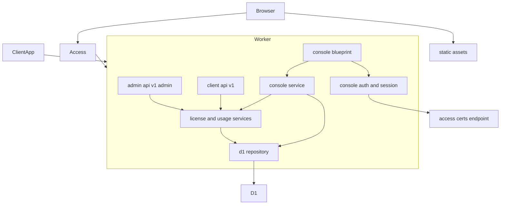
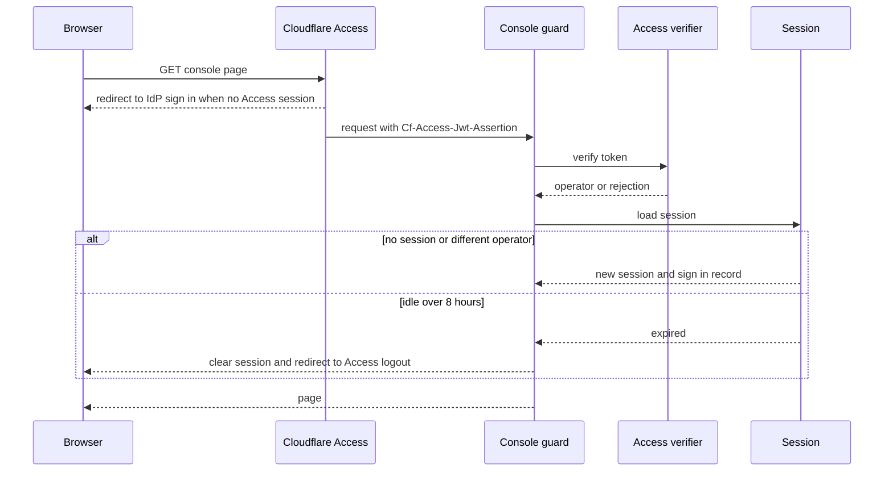
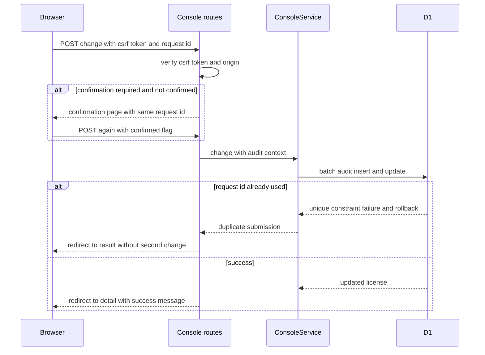
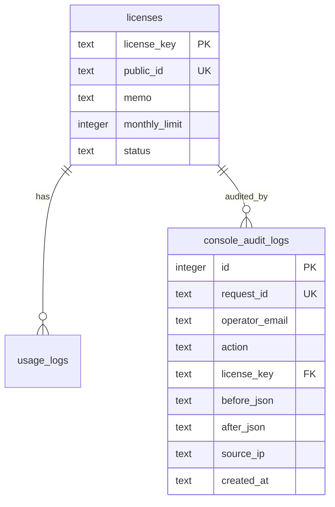

# Design Document: Admin Console

## Overview
**Purpose**: License Usage Service の運営者が、ブラウザからライセンスの発行・検索・変更・停止・再開と、利用状況・利用履歴の確認を安全に行える管理画面を提供する。
**Users**: 社内の運営担当者（数名〜十数名）が、契約対応・問い合わせ対応・不正利用対応で使う。
**Impact**: 既存の Worker に画面用の経路 `/console` を追加し、ライセンスに「メモ」と画面用の公開 ID を追加し、運営者の操作記録を新たに保存する。クライアント向け API（`/v1/*`）と管理 API（`/v1/admin/*`）の契約は変えない。

画面上では「メモ」を「ライセンシー」と表示する（利用者の指定）。データの列名・フォームの項目名・コードは `memo` のままとする。

運営者のサインインは Cloudflare Access に任せる。Access が IdP（Google Workspace など）での本人確認・多要素認証・サインイン失敗の制限・サインイン記録を担い、Worker は Access が付与する JWT を検証して運営者を識別する。画面は Flask＋Jinja2 のサーバー側描画とし、既存のサービス層を同じ Worker 内から直接呼ぶ。

### Goals
- 要件 1〜8 の受け入れ基準をすべて満たす管理画面を、既存の Worker と D1 の上に追加する。
- 運営者ごとに、誰がいつどのライセンスに何をしたかを変更前後の値とともに記録する。
- ライセンスキー・認証情報を URL・ログ・ブラウザ側のコードに露出させない。
- ローカルの docker compose 環境で、Access なしに画面を動作確認できる。

### Non-Goals
- 顧客・エンドユーザー向けの画面、課金・決済、グラフやレポートの出力、スマートフォン向けの最適化。
- 運営者アカウントの管理画面（運営者の追加・削除は Cloudflare Access のポリシーで行う）。
- 管理 API（`/v1/admin/*`）経由の操作の記録（API には運営者を識別する情報がないため）。
- ライセンス・利用履歴・操作記録の削除。

## Boundary Commitments

### This Spec Owns
- `/console` 以下の画面・フォーム・静的ファイル（CSS・JavaScript）。
- 運営者の識別（Access JWT の検証）、画面用セッション（無操作 8 時間での失効）、CSRF 対策、二重送信防止、画面のセキュリティヘッダー。
- ライセンスの一覧・検索、メモの登録・変更、操作記録の保存と表示。
- データ追加: `licenses.memo`、`licenses.public_id`、`console_audit_logs` テーブル（マイグレーション `0002`）。

### Out of Boundary
- 有効性判定・利用記録・月間上限・暦月の規則（license-usage-service が所有。本 spec は変更しない）。
- クライアント向け API と管理 API の要求・応答の形（変更しない。メモや公開 ID を API 応答に追加しない）。
- IdP での本人確認、多要素認証、サインイン失敗の制限、サインインの成否記録（Cloudflare Access と IdP が所有）。
- Access アプリケーションとポリシーの作成（運用手順として記載するのみ）。

### Allowed Dependencies
- 既存の `domain`・`repository`・`services`（`LicenseService`・`UsageService`・上限値検証・期間計算）。
- 既存の `http.rate_limit`（レート制限ガード）、`http.access_log`（アクセスログ）、`http.responses` の `status_for`（`ErrorCode` → HTTP ステータス）。
- Cloudflare Access（JWT と公開鍵エンドポイント）、D1、Workers Static Assets。
- 追加の Python パッケージは使わない（Flask 同梱の Jinja2・itsdangerous・MarkupSafe のみ）。

### Revalidation Triggers
- `licenses` テーブルの列やライセンスの状態の追加・変更（一覧・詳細・操作記録の表示に影響）。
- 期間計算（JST 暦月）の変更（画面の月選択と利用状況の表示に影響）。
- Access のアプリケーション範囲（`/console`）やカスタムドメインの変更。
- `Dependencies` の構成や `create_app` の引数の変更。

## Architecture

### Existing Architecture Analysis
- レイヤーは `domain` → `config` → `repository` → `services` → `http` → `worker.py` の一方向。SQL は `repository/sql.py` に集約し、D1 実装とテスト用 SQLite 実装で共有する。
- 依存はリクエスト単位でファクトリから生成し（`Dependencies`）、ルートは `current()` で取得する。
- 共通エラーハンドラはすべて JSON を返す。画面の追加後も `/v1/*` では JSON のまま維持する必要がある（8.6）。
- D1 は 50 バイトを超える LIKE パターンを拒否するため、検索は `instr()` を使う。

### Architecture Pattern & Boundary Map



**Architecture Integration**:
- Selected pattern: 既存 Worker 内への Blueprint 追加（サーバー側描画）。サービス層を共有し、画面固有の関心（認証・セッション・CSRF・フォーム・表示）は `console` パッケージに閉じ込める。
- Domain/feature boundaries: 画面の変更操作はすべて `ConsoleService` を通し、データ更新と操作記録を 1 回の D1 `batch()` で原子的に書く。既存の `LicenseService` の API 用の変更メソッドは操作記録を書かない。
- Existing patterns preserved: SQL の集約と共有、リクエスト単位の依存生成、Protocol によるリポジトリ抽象、固定文言のエラー、ライセンスキーを出さないログ（画面のログにはフィンガープリントも出さない）。
- New components rationale: Access JWT の検証（外部連携）、画面セッション（状態）、操作記録（新しいデータ）はいずれも新しい境界のため独立させる。
- Dependency direction: `domain` → `config` → `repository` → `services` → `http` / `console` → `wiring` → `app` → `worker.py`。`http` と `console` は互いに import しない（`console` が使うレート制限・アクセスログ・ステータス変換は例外として `http.rate_limit`・`http.access_log`・`http.responses` のみ import 可）。`wiring`（本番の依存生成）と `app`（アプリ組み立て）だけが両方を知る。

### Technology Stack

| Layer | Choice / Version | Role in Feature | Notes |
|-------|------------------|-----------------|-------|
| Frontend | Jinja2 3.1.6（Flask 同梱）、Bootstrap 5.3.8（CSS と JS を `public/console/assets/vendor/bootstrap/` に同梱）、最小限の独自 JavaScript | サーバー側描画、ハンバーガーメニュー（offcanvas）、クリップボードコピー | SPA は使わない。CDN は CSP（`'self'` のみ）に反するため使わない。発行とサインアウトはハンバーガーメニューから開く（メニューの開閉には JavaScript が必要） |
| Backend | Flask 3.1.3、itsdangerous 2.2.0（署名付き Cookie） | 画面ルート、画面セッション | 追加依存なし |
| Auth | Cloudflare Access（アプリケーショントークン、RS256） | 運営者の本人確認と識別 | 署名検証は純 Python で実装（後述） |
| Data | D1（SQLite）、マイグレーション `0002` | メモ・公開 ID・操作記録 | JSON1 の `json_object()` を使用 |
| Infrastructure | Workers Static Assets（`public/`） | CSS・JavaScript の配信 | Access の保護範囲内に置く |

## File Structure Plan

### Directory Structure
```
migrations/
└── 0002_admin_console.sql             # memo・public_id 列、console_audit_logs テーブル、索引
public/
├── _headers                           # 静的ファイル（/console/assets/*）のセキュリティヘッダー
└── console/assets/
    ├── vendor/bootstrap/              # bootstrap.min.css、bootstrap.bundle.min.js、LICENSE（MIT）
    ├── console.css                    # Bootstrap への小さな追加スタイル
    ├── console.js                     # クリップボードコピー、二重クリック防止（補助）、検索フォームの状態選択での送信、戻る操作後の送信済み解除
    └── favicon.svg                    # ファビコン兼ナビゲーションバーのロゴ
src/license_server/
├── domain/
│   ├── types.py                       # License に memo・public_id を追加。LicenseListItem, LicenseSearch, LicenseSort, SortOrder, AuditEntry, AuditAction, AuditValues, Operator, AuditContext, UNLIMITED
│   └── period.py                      # JST 表示用の変換、JST 日付範囲 → UTC 半開区間（Period）、当月の初日・末日
├── repository/
│   ├── base.py                        # ConsoleRepository Protocol、DuplicateSubmission
│   ├── sql.py                         # 一覧・検索、公開 ID での取得、操作記録付き更新の SQL
│   └── d1.py                          # ConsoleRepository の D1 実装
├── services/
│   └── console_service.py             # 一覧・詳細・発行・変更・停止・再開・メモ・操作記録の参照
├── console/
│   ├── __init__.py
│   ├── dependencies.py                # ConsoleDependencies と current_console()
│   ├── access.py                      # Access JWT の検証（RS256・クレーム）と公開鍵の取得・キャッシュ
│   ├── session.py                     # 運営者セッション（無操作失効）、CSRF トークン、フラッシュメッセージ
│   ├── security.py                    # CSRF・Origin 検証、セキュリティヘッダー、ループバック判定
│   ├── forms.py                       # フォーム値の解析と項目別エラー
│   ├── messages.py                    # ErrorCode・検証エラー → 日本語メッセージ
│   ├── routes.py                      # Blueprint "console"（/console）と認証ガード（before_request）
│   ├── errors.py                      # /console の HTML エラー応答、セッション保存とセキュリティヘッダーの after_request
│   └── templates/console/             # base, _macros, licenses_list, license_new, license_detail, usage_logs, confirm, error, signed_out
├── wiring.py                          # 本番の依存生成（workers.env → D1・サービス・Access 検証器）
└── app.py                             # console Blueprint の登録、/console の HTML エラー処理
tests/
├── fakes/sqlite_repository.py         # ConsoleRepository を追加実装
├── fakes/access.py                    # テスト用 RSA 鍵ペアと JWT 生成、偽の公開鍵取得
├── unit/console/                      # test_access, test_session, test_security, test_forms, test_messages
├── unit/services/test_console_service.py
├── contract/test_console_repository_contract.py   # ConsoleRepository の契約テスト
└── integration/console/               # conftest（偽の Access 鍵とテスト用ブラウザ）、test_console_common（認証・ヘッダー・エラー）、
                                       # test_console_pages（各画面）、test_console_scenarios（通し操作と API との整合）、test_console_logging
scripts/
├── console_http.py                    # 開発サーバー用の最小ブラウザ（__Host- Cookie を手動で扱う）
├── console_smoke.py                   # 開発サーバーで画面の主要操作を確認
├── console_browser_check.py           # 実ブラウザ（Chrome・WebKit）で画面を操作（Cookie と Origin はブラウザ任せ）
├── console_runtime_check.py           # セキュリティヘッダー、/v1 の不変、二重送信（再送・同時）の確認
├── console_d1_check.py                # ローカル D1 での SQL の意味（batch の取り消し、json_object、instr）
└── console_access_fetch_check.py      # ランタイムの fetch で Access の公開鍵を取得できることの確認
```

### Modified Files
- `src/license_server/domain/types.py` — `License` に `memo: str = ""`、`public_id: str | None = None` を末尾に追加する（既存の生成箇所に影響させない）。
- `src/license_server/repository/sql.py` — ライセンスの SELECT 列に `memo`・`public_id` を追加し、`INSERT_LICENSE` で `public_id` を SQL 側で生成する（API で発行したライセンスにも公開 ID を付けるため）。
- `src/license_server/http/dependencies.py` — `workers_dependencies` を `wiring.py` へ移す（`http` から `console` を参照しないため）。`Dependencies`・`current()`・ガードはそのまま残す。
- `src/license_server/config.py` — `ConsoleSettings` と `console_settings_from_environ` を追加する（空文字・文字列以外は未設定扱い、チーム ドメインは `https://host` に正規化。ホスト名として不正な値や `https` 以外のスキームも未設定扱い）。
- `src/license_server/http/access_log.py` — `remember_operator(email)` を追加し、設定された要求だけログに `operator` を含める。
- `src/license_server/app.py` — `create_app(dependencies, console_dependencies=None)` に拡張し、console Blueprint を登録する。`/console` 配下のエラーは HTML で返す。
- `src/worker.py` — `wiring` のファクトリを使う。
- `wrangler.jsonc` — `assets`（`public/`）と `vars`（`ACCESS_TEAM_DOMAIN`・`ACCESS_AUD`）を追加する。`src/` 配下の `.html` は pywrangler が追加設定なしでバンドルに含める（タスク 1.1 で `wrangler dev` と `deploy --dry-run` の両方で確認済み）。
- `.dev.vars.example` — `CONSOLE_SESSION_SECRET`・`CONSOLE_DEV_OPERATOR_EMAIL` を追加する。
- `tests/fakes/sqlite_repository.py`、既存テスト — `License` の新しい列に合わせる。

## System Flows

### 画面リクエストの認証とセッション



- JWT がない・検証に失敗した場合、Worker は画面を表示せず 403 の「サインインが必要です」ページを返す（Access を迂回された場合の防御）。
- 無操作失効時は画面セッションを消去し、Access のログアウト（`/cdn-cgi/access/logout`）へ送る。これにより IdP での再サインインが必要になる（1.5）。ローカル開発用運営者の場合は Access がないため `/console/signed-out`（認証不要の案内ページ）へ送る。
- ローカル開発では、`CONSOLE_DEV_OPERATOR_EMAIL` が設定され、`ACCESS_TEAM_DOMAIN`・`ACCESS_AUD` がどちらも未設定で、かつ要求先ホストがループバックの場合に限り、JWT 検証の代わりに固定の開発用運営者（`subject` は `dev:<email>`）として扱う。

### 変更操作（確認・CSRF・二重送信防止・操作記録）



- 確認が必要な操作: 停止（4.3）、再開（4.4）、当月利用回数未満への上限変更（4.6）。確認画面は同じ `request_id` を引き継ぐ。
- 成功時は Post/Redirect/Get で詳細画面へ戻し、再読み込みによる再送を防ぐ。

## Requirements Traceability

| Requirement | Summary | Components | Interfaces | Flows |
|-------------|---------|------------|------------|-------|
| 1.1 | 未サインインでは内容を表示しない | Access, ConsoleGuard | `require_operator` | 認証 |
| 1.2 | サインイン後にトップと運営者を表示 | ConsoleGuard, routes, base テンプレート | `Operator` | 認証 |
| 1.3 | 存在を推測させない失敗表示 | Access・IdP（Out of Boundary） | — | — |
| 1.4 | サインアウト | ConsoleSession, routes | `POST /console/sign-out` | 認証 |
| 1.5 | 無操作 8 時間で失効 | ConsoleSession | `touch()` | 認証 |
| 1.6 | サインイン失敗の制限 | Access・IdP（Out of Boundary） | — | — |
| 2.1 | 一覧の表示項目（上限は出さない） | ConsoleService, ConsoleRepository | `search` | — |
| 2.2 | メモ・キーの部分一致検索（Enter で送信） | ConsoleRepository（`instr`） | `LicenseSearch.query` | — |
| 2.3 | 状態での絞り込み（選択で送信） | ConsoleRepository, console.js | `LicenseSearch.status` | — |
| 2.4 | 20 件ごとのページ分けと番号付きページャー | ConsoleService, ConsoleRepository, routes | `LicensePage`, `count_matching` | — |
| 2.5 | 該当なしの表示 | licenses_list テンプレート | — | — |
| 2.6 | 初期状態は新しい順 | ConsoleRepository | ORDER BY | — |
| 2.7 | 当月利用回数・発行日時での並べ替え | forms（`parse_sort`）, ConsoleRepository | `LicenseSearch.sort`・`order` | — |
| 3.1 | 上限なし（0）での発行とキーの表示 | ConsoleService, routes, forms（`parse_issue`） | `issue` | 変更操作 |
| 3.2 | クリップボードコピー | console.js | — | — |
| 3.3 | 送信された上限値の検証 | forms, `validate_monthly_limit` | `FormErrors` | — |
| 3.4 | メモの文字数上限 | forms, `validate_memo` | `FormErrors` | — |
| 3.5 | 発行後に詳細へ | routes | PRG | 変更操作 |
| 4.1 | 詳細の表示項目（上限・残り回数は出さない） | ConsoleService | `detail` | — |
| 4.2 | 上限変更（画面にフォームなし。経路は残す） | ConsoleService | `update_limit` | 変更操作 |
| 4.3 | 停止の確認 | routes, confirm テンプレート | `suspend` | 変更操作 |
| 4.4 | 再開の確認 | routes, confirm テンプレート | `activate` | 変更操作 |
| 4.5 | メモ変更 | ConsoleService | `update_memo` | 変更操作 |
| 4.6 | 利用回数未満への上限変更の警告 | routes | `needs_limit_warning` | 変更操作 |
| 4.7 | 不正値の拒否 | forms, ConsoleService | `FormErrors` | — |
| 4.8 | 削除操作なし | routes（削除ルートを持たない） | — | — |
| 5.1 | 月別の利用回数 | ConsoleService, `UsageService.monthly_count` | `detail(month)` | — |
| 5.2 | 期間指定の履歴 | ConsoleService, `UsageService.list_logs` | `usage_logs` | — |
| 5.3 | 履歴の続き | routes（`after_id`） | `UsagePage` | — |
| 5.4 | 期間の入力誤り | forms | `FormErrors` | — |
| 5.5 | 日本時間の表示と暦月 | period（JST 変換）, テンプレートフィルタ | `format_jst` | — |
| 5.6 | 期間未指定は当月 | forms | `parse_date_range` | — |
| 6.1 | 操作の記録 | ConsoleRepository（batch） | `AuditContext` | 変更操作 |
| 6.2 | 詳細で操作記録を表示 | ConsoleService | `detail` | — |
| 6.3 | 操作記録を変更・削除できない | routes, ConsoleRepository（更新・削除 SQL を持たない） | — | — |
| 6.4 | サインインの記録 | Access のログ（成功・失敗）＋ ConsoleSession の `sign_in` 記録（成功） | `record_sign_in` | 認証 |
| 7.1 | キーを URL に含めない | routes（`public_id` を使用、検索条件は POST＋セッション） | — | — |
| 7.2 | 暗号化経路のみ | カスタムドメイン＋Always Use HTTPS、`Secure` Cookie | — | — |
| 7.3 | 外部から誘導された操作の拒否 | ConsoleSecurity（CSRF・Origin） | `verify_csrf` | 変更操作 |
| 7.4 | ログに平文を出さない | access_log（フィンガープリント）、ConsoleSession | — | — |
| 7.5 | 埋め込み禁止 | ConsoleSecurity（ヘッダー） | `apply_security_headers` | — |
| 7.6 | 入力値をプログラムとして実行させない | Jinja2 自動エスケープ、CSP | — | — |
| 8.1 | 成功の表示 | ConsoleSession（フラッシュ） | `flash` | 変更操作 |
| 8.2 | 見つからない表示 | routes, error テンプレート | 404 | — |
| 8.3 | 一時的障害の表示 | app（/console の HTML エラー処理） | 503 | — |
| 8.4 | 要求制限の表示 | ConsoleGuard（`enforce_rate_limit`） | 429 | — |
| 8.5 | 二重実行の防止 | ConsoleRepository（`request_id` 一意） | `DuplicateSubmission` | 変更操作 |
| 8.6 | クライアント向け機能を変えない | app（JSON 処理は `/v1` で維持）、dto 不変 | — | — |

## Components and Interfaces

| Component | Domain/Layer | Intent | Req Coverage | Key Dependencies (P0/P1) | Contracts |
|-----------|--------------|--------|--------------|--------------------------|-----------|
| AccessVerifier | console | Access JWT の署名・クレーム検証 | 1.1, 1.2, 6.4 | Access certs (P0) | Service |
| ConsoleSession | console | 運営者セッション・無操作失効・CSRF トークン・フラッシュ | 1.4, 1.5, 7.3, 8.1 | itsdangerous (P0) | Service, State |
| ConsoleSecurity | console | 認証ガード、CSRF・Origin 検証、ヘッダー、レート制限 | 1.1, 7.3, 7.5, 7.6, 8.4 | AccessVerifier (P0), rate_limit (P1) | Service |
| ConsoleService | services | 画面用のライセンス操作と参照 | 2.x, 3.1, 4.x, 5.1, 5.2, 6.1, 6.2 | ConsoleRepository (P0), UsageService (P0) | Service |
| ConsoleRepository | repository | 一覧・検索、操作記録付き更新 | 2.x, 6.1, 6.3, 8.5 | D1 (P0) | Service, State |
| forms / messages | console | 入力の解析・検証、日本語メッセージ | 3.3, 3.4, 4.7, 5.4, 5.6 | services の検証関数 (P1) | Service |
| routes / templates | console | 画面とフォーム | 1.2, 2.5, 3.x, 4.x, 5.x, 8.x | ConsoleService (P0) | API |
| wiring | composition | 本番の依存生成 | 全般 | config (P0) | Service |

### Domain

```python
class AuditAction(StrEnum):
    ISSUE = "issue"
    UPDATE_LIMIT = "update_limit"
    SUSPEND = "suspend"
    ACTIVATE = "activate"
    UPDATE_MEMO = "update_memo"
    SIGN_IN = "sign_in"

@dataclass(frozen=True)
class Operator:
    email: str          # Access JWT の email（表示と記録に使う）
    subject: str        # Access JWT の sub（セッションの本人一致確認に使う）

@dataclass(frozen=True)
class AuditContext:
    operator: Operator
    request_id: str     # フォームごとに発行する UUID。二重送信判定に使う
    source_ip: str | None
    now_utc: str

@dataclass(frozen=True)
class AuditEntry:
    id: int
    operator_email: str
    action: AuditAction
    before: dict[str, str | int] | None
    after: dict[str, str | int] | None
    created_at: str

@dataclass(frozen=True)
class LicenseSearch:
    query: str | None               # メモまたはキーの部分一致（最大 100 文字）
    status: LicenseStatus | None
    page: int                       # 1 始まり

@dataclass(frozen=True)
class LicenseListItem:
    license: License
    used_this_month: int

class LicenseSort(StrEnum):
    CREATED_AT = "created_at"
    MONTHLY_LIMIT = "monthly_limit"
    USED = "used"

class SortOrder(StrEnum):
    ASC = "asc"
    DESC = "desc"

AuditValues = dict[str, str | int]  # AuditEntry の before・after の型
UNLIMITED = 0                       # 月間上限 0 は上限なし（画面から発行するライセンスの既定）

def format_jst(utc_text: str) -> str: ...                       # "2026-09-28 13:45:00"（日本時間）
def jst_date_range(start: date, end: date) -> Period: ...       # [start 00:00 JST, end 翌日 00:00 JST) の UTC 半開区間
def jst_month_bounds(now_utc: datetime) -> tuple[date, date]: ...  # 当月（JST）の初日と末日
```
- `LicenseSearch` には `sort: LicenseSort = CREATED_AT` と `order: SortOrder = DESC` もある。
- `License` には `memo: str = ""` と `public_id: str | None = None` を追加する。`public_id` は `lic_` ＋ 16 桁の小文字 16 進数で、画面の URL でライセンスを指す唯一の識別子とする。

### Console

#### AccessVerifier

| Field | Detail |
|-------|--------|
| Intent | `Cf-Access-Jwt-Assertion` の JWT を検証し、運営者を返す |
| Requirements | 1.1, 1.2, 6.4 |

**Responsibilities & Constraints**
- ヘッダーは `alg: RS256` のみ受け付ける（`none`・HS 系は拒否）。`kid` に一致する公開鍵で署名を検証する。
- クレーム検証: `iss` がチーム ドメインと一致、`aud`（文字列または配列）に `ACCESS_AUD` を含む、`exp` が現在より後、`nbf`（あれば）が現在以前（`exp`・`nbf` とも許容誤差 60 秒。数値でなければ拒否）、`type` が `app`、`email` と `sub` が空でない。
- 署名検証は RFC 8017 §8.2.2 に従い、署名値から復元した値と、期待する EMSA-PKCS1-v1_5（SHA-256 の DigestInfo 付き）の符号化を**全体一致**で比較する（ASN.1 の解析はしない）。公開鍵は JWK の `n`・`e` を整数として使う。
- 公開鍵は `https://<team>.cloudflareaccess.com/cdn-cgi/access/certs` から取得し、Worker インスタンス内で 1 時間キャッシュする。未知の `kid` を受け取ったときは 1 回だけ再取得する。
- JWT・Cookie の値はログに出さない。拒否理由の分類は `malformed`・`bad_algorithm`・`unknown_key`・`bad_signature`・`bad_issuer`・`bad_audience`・`expired`・`not_yet_valid`・`bad_type`・`missing_identity`。

**Dependencies**
- Outbound: `CertsFetcher`（公開鍵の取得。本番は `js.fetch`＋`run_sync`）(P0)
- External: Cloudflare Access (P0)

**Contracts**: Service [x]

##### Service Interface
```python
class CertsFetcher(Protocol):
    def fetch(self, url: str) -> Mapping[str, Any]: ...        # JWKS の JSON

class AccessVerifier:
    def __init__(self, team_domain: str, audience: str, fetcher: CertsFetcher,
                 clock: Callable[[], datetime]) -> None: ...
    def verify(self, token: str) -> Operator: ...              # 失敗時は AccessDenied

class AccessDenied(Exception): ...                             # 理由は内部ログ用の短い分類のみ
class AccessUnavailable(Exception): ...                        # 公開鍵を取得できない（503）
```
- Preconditions: `team_domain` は `https://` で始まり末尾に `/` を含まない。
- Postconditions: 返す `Operator` の `email`・`subject` は空でない。

**Implementation Notes**
- Integration: 本番の `CertsFetcher`（`WorkersCertsFetcher`）は `js.fetch` を `run_sync` で同期化する。取得失敗は `AccessDenied` ではなく `AccessUnavailable` とし、`RepositoryUnavailable` と同様の一時的障害として扱う（503）。2048 ビット未満の RSA 鍵は無視する。検証器は `wiring` のモジュール変数に（チーム ドメイン、AUD）ごとに保持し、公開鍵のキャッシュを Worker インスタンス内の要求間で共有する。
- Validation: テストでは `tests/fakes/access.py` の固定 RSA 鍵ペアで JWT を生成し、改ざん・期限切れ・`aud` 不一致・`alg` 差し替えを検証する。
- Risks: 実際の Access トークンでの検証はデプロイ後にしか行えない。デプロイ手順に確認項目として含める。

#### ConsoleSession

| Field | Detail |
|-------|--------|
| Intent | 運営者ごとの画面セッション、無操作失効、CSRF トークン、フラッシュメッセージ |
| Requirements | 1.4, 1.5, 6.4, 7.3, 8.1 |

**Responsibilities & Constraints**
- 署名付き Cookie（itsdangerous の `URLSafeSerializer`、秘密鍵 `CONSOLE_SESSION_SECRET`）に、`operator_subject`・`last_seen`（UTC エポック秒）・`csrf_token`・フラッシュ・一覧の検索条件を保存する。Workers では秘密鍵を要求ごとにしか読めないため、アプリ生成時に `secret_key` を固定する Flask 標準のセッションは使わず、要求の開始時に読み込み、応答時に保存する。署名のみで暗号化はしないため、検索条件以外にライセンスキーを保存しない（検索条件も運営者自身が入力した値に限る）。
- 5xx の応答ではセッションを保存しない（障害時にフラッシュや `last_seen` を進めない）。
- 署名は有効期限なし（`URLSafeSerializer`、salt `license-server.console-session`）で、失効は `last_seen` で判定する。署名が不正な Cookie は空のセッションとして扱う。保存するキーは `operator_subject`・`last_seen`・`csrf_token`・`flashes`・`search`（検索語 `q` と状態 `status`）。
- Cookie 属性: 名前 `__Host-console`、`Secure`、`HttpOnly`、`SameSite=Lax`、`Path=/`。`Max-Age`・`Expires` は付けない（ブラウザを閉じると消えるセッション Cookie）。ループバックのホストへの `http` 接続（ローカル開発）に限り、名前 `console-local`・`Secure` なしにする。Safari（WebKit）は `http://localhost` で `Secure` Cookie を保存せず、`__Host-` の名前は `Secure` が必須のため。
- `touch(operator, now)`: セッションがない、または `operator_subject` が異なる場合は新しいセッションを作り（CSRF トークンを再生成）、`True` を返す。呼び出し側のガードが `sign_in` を操作記録に残す。`now - last_seen` が 8 時間を超える場合は `SessionExpired` を送出する（8 時間ちょうどは有効）。それ以外は `last_seen` を更新する。
- 失効時はセッションを消去し、ログアウト先（Access のログアウト、ローカル開発用運営者では `/console/signed-out`）へ 302 で送る。
- サインアウトはセッションを消去し、Access のログアウトへ送る。

**Contracts**: Service [x] / State [x]

##### Service Interface
```python
IDLE_TIMEOUT = timedelta(hours=8)

class SessionExpired(Exception): ...

class ConsoleSession:
    @classmethod
    def load(cls, cookie: str | None, secret: str) -> "ConsoleSession": ...  # 署名不正は空のセッション
    def save(self, response: Response, secret: str, secure: bool = True) -> None: ...  # 消去済みなら Cookie を削除
    def touch(self, operator: Operator, now: datetime) -> bool: ...   # 新規セッションなら True
    def csrf_token(self) -> str: ...
    def clear(self) -> None: ...
    def flash(self, message: str) -> None: ...
    def pop_flashes(self) -> list[str]: ...
    def set_search(self, query: str | None, status: LicenseStatus | None) -> None: ...
    def search(self) -> tuple[str | None, LicenseStatus | None]: ...
```

##### State Management
- State model: Cookie のみ（サーバー側に保存しない）。Cookie のサイズは 1 KB 未満に保つ。
- Persistence & consistency: 秘密鍵の変更で全セッションが無効になる（全員が再サインイン）。

#### ConsoleSecurity

| Field | Detail |
|-------|--------|
| Intent | 画面リクエストの共通ガードと応答ヘッダー |
| Requirements | 1.1, 7.2, 7.3, 7.5, 7.6, 8.4 |

**Responsibilities & Constraints**
- `before_request`（console Blueprint のみ、`routes.py`）で、レート制限 → 設定の確認 → 運営者の識別（Access またはローカル開発用）→ セッションの `touch`（新規なら `sign_in` を記録）→ POST なら CSRF・送信元の検証、の順に適用する。`/console/signed-out` は認証なし・レート制限なしで表示する。
  - レート制限は API と同じ `RATE_LIMITER` を送信元 IP（`CF-Connecting-IP`、なければ `"unknown"`）で使うため、API と画面で 1 つの枠を共有する。
  - `sign_in` の記録は CSRF の検証より前に行う（新しいセッションで最初に届いた要求が拒否される POST でも、サインイン自体は記録される）。
  - ローカル開発用運営者は、ループバック以外のホストへの要求では使わず 503（未設定）とする。
  - Blueprint のルートに一致しない `/console/...` はガードを通らずに 404 の HTML を返す（内容を含まないため認証は不要）。
  - ファクトリ（`console_dependencies`）が渡されていないアプリでは、画面は 503（一時的な障害）になる。
- セキュリティヘッダーは app 全体の `after_request`（`errors.py`）で、Worker が返す `/console` 配下のすべての応答に付ける。Blueprint に一致しない `/console/...` の 404 や、ガードで止めた応答も対象になる。`public/console/assets/` の静的ファイルは Workers Static Assets が Worker より前に返すため、`public/_headers` で `/console/assets/*` に CSP（`default-src 'none'; style-src 'self'; img-src 'self' data:; frame-ancestors 'none'; base-uri 'none'`）・`X-Frame-Options`・`X-Content-Type-Options`・`Referrer-Policy`・HSTS を付ける（`Cache-Control` は Static Assets の既定のまま。キーを含まないため）。`_headers` 自体は配信されない。
- 変更操作（POST）では、フォームの `csrf_token` とセッションの値を定数時間比較し、`Origin` ヘッダー（なければ `Referer`）が自サイトと一致することを確認する。不一致は 403 で拒否し、操作を実行しない。`Origin: null` も不一致として扱う。
- 応答ヘッダー: `Content-Security-Policy: default-src 'self'; script-src 'self'; style-src 'self'; img-src 'self' data:; form-action 'self'; frame-ancestors 'none'; base-uri 'none'`（`img-src` の `data:` は Bootstrap の CSS に埋め込まれた SVG アイコン用。画像としての SVG はスクリプトを実行しない）、`X-Frame-Options: DENY`、`X-Content-Type-Options: nosniff`、`Referrer-Policy: same-origin`（`no-referrer` にするとブラウザがフォーム送信時に `Origin: null` を送り、送信元の検証で全操作が拒否されるため）、`Cache-Control: no-store`（キーを含むページをキャッシュさせない）、`Strict-Transport-Security: max-age=31536000`（7.2。ループバックの開発環境では付けない）。
- テンプレートは Jinja2 の自動エスケープを有効にし、`|safe` を使わない。インライン JavaScript・インライン style は使わない。

**Contracts**: Service [x]

##### Service Interface
```python
def verify_csrf(form_token: str | None, session_token: str, origin: str | None,
                referer: str | None, host_url: str) -> None: ...            # 失敗時 CsrfRejected
def apply_security_headers(response: Response, hsts: bool) -> Response: ...
def is_loopback_host(host: str) -> bool: ...                               # HSTS と開発用運営者の判定
def is_local_http(scheme: str, host: str) -> bool: ...                     # Secure なしの開発用 Cookie を使う条件
```
- 運営者の識別は `routes.py` の内部関数で行い、失敗時は `NotSignedIn`（403）、未設定は `NotConfigured`（503）を送出する。

#### ConsoleDependencies / wiring

```python
@dataclass(frozen=True)
class ConsoleDependencies:
    console: ConsoleService
    verifier: AccessVerifier | None          # Access 未設定なら None
    dev_operator: Operator | None            # ローカル開発時のみ
    session_secret: str | None
    rate_limiter: RateLimiter | None
    clock: Callable[[], datetime]

    @property
    def configured(self) -> bool: ...        # 秘密鍵があり、検証器か開発用運営者のどちらかがある

ConsoleDependencyFactory = Callable[[], ConsoleDependencies]
```
- `wiring.workers_dependencies()`（既存を移設）と `wiring.workers_console_dependencies()` が `config.bindings_from_environ` の値から生成する。
- 設定値: `ACCESS_TEAM_DOMAIN`・`ACCESS_AUD`（`vars`）、`CONSOLE_SESSION_SECRET`（Secret）、`CONSOLE_DEV_OPERATOR_EMAIL`（ローカルの `.dev.vars` のみ）。
- `verifier` も `dev_operator` もない場合、画面は常に 503「管理画面が設定されていません」を返す（フェイルクローズ）。`CONSOLE_SESSION_SECRET` がない場合も同様。`ACCESS_TEAM_DOMAIN`・`ACCESS_AUD` の片方だけが設定されている場合は、検証器も開発用運営者も作らず 503 になる。`ACCESS_TEAM_DOMAIN` が不正な値（ホスト名として不正、`https` 以外のスキーム）の場合は未設定と同じ扱いになる。

### Services

#### ConsoleService

| Field | Detail |
|-------|--------|
| Intent | 画面向けのライセンス一覧・詳細・変更と操作記録の参照 |
| Requirements | 2.1, 2.2, 2.3, 2.4, 2.6, 3.1, 4.1, 4.2, 4.3, 4.4, 4.5, 5.1, 5.2, 6.1, 6.2 |

**Responsibilities & Constraints**
- 上限値の検証は既存の `validate_monthly_limit` を使い、メモの検証は `validate_memo` を新設する（前後の空白を除去、200 文字以内、改行・制御文字（Unicode の Cc・Zl・Zp）と双方向テキストの制御文字を含まない）。
- 変更はすべて `AuditContext` を伴い、`ConsoleRepository` の操作記録付きメソッドで行う。
- 利用状況と履歴は既存の `UsageService.monthly_count` と `list_logs` を使う（規則の重複実装をしない）。
- 1 ページの件数: ライセンス一覧 20 件、利用履歴 100 件、操作記録（詳細画面）最新 50 件。
- 一覧は先に条件に一致する件数を数えてページ数を求め、最終ページを超える番号は最終ページに丸めてから該当ページを取得する（件数 0 のときも 1 ページとする）。

**Contracts**: Service [x]

##### Service Interface
```python
LICENSE_PAGE_SIZE = 20
MAX_MEMO_LENGTH = 200
MAX_QUERY_LENGTH = 100

@dataclass(frozen=True)
class LicensePage:
    items: list[LicenseListItem]
    page: int                        # 丸めた後のページ番号
    total: int                       # 条件に一致する全件数
    page_count: int                  # 1 以上
    # 派生値: has_next、first_number（件数 0 なら 0）、last_number

@dataclass(frozen=True)
class LicenseDetail:
    license: License
    summary: UsageSummary            # 選択月（既定は当月）
    audits: list[AuditEntry]

def validate_memo(value: object) -> str: ...                     # 不正は ServiceError(INVALID_REQUEST)

USAGE_PAGE_SIZE = 100
AUDIT_DISPLAY_LIMIT = 50

class ConsoleService:
    def __init__(self, repo: ConsoleRepository, usage: UsageService,
                 clock: Callable[[], datetime],
                 key_generator: Callable[[], str] = generate_license_key) -> None: ...
    def context(self, operator: Operator, request_id: str, source_ip: str | None) -> AuditContext: ...  # 現在時刻を入れる
    def search(self, criteria: LicenseSearch) -> LicensePage: ...
    def license(self, public_id: str) -> License: ...          # 確認画面・履歴画面の表示用
    def detail(self, public_id: str, month: tuple[int, int] | None) -> LicenseDetail: ...
    def issue(self, monthly_limit: object, memo: object, ctx: AuditContext) -> License: ...
    def update_limit(self, public_id: str, monthly_limit: object, ctx: AuditContext) -> License: ...
    def suspend(self, public_id: str, ctx: AuditContext) -> License: ...
    def activate(self, public_id: str, ctx: AuditContext) -> License: ...
    def update_memo(self, public_id: str, memo: object, ctx: AuditContext) -> License: ...
    def usage_logs(self, public_id: str, period: Period,
                   after_id: int | None) -> tuple[License, list[UsageLogEntry], int | None]: ...
    def record_sign_in(self, ctx: AuditContext) -> None: ...
    def license_for_request(self, request_id: str) -> License | None: ...  # 二重送信時の遷移先
```
- 存在しない `public_id` は `ServiceError(LICENSE_NOT_FOUND)`。
- `issue` はキー重複時に最大 3 回再生成する（既存の `LicenseService.issue` と同じ規則）。3 回とも重複した場合は `RepositoryUnavailable`（503）。発行の操作記録は `before` を NULL、`after` を `{"monthly_limit", "memo"}` とする。
- メモと上限の変更は、値が変わらない場合も操作記録を残す（停止・再開と異なり、変化の有無を判定しない）。
- 二重送信（`request_id` の再利用）は `DuplicateSubmission` をそのまま送出し、画面側で元の結果へ遷移させる。
- 停止中への `suspend`、有効への `activate` は状態を変えずに成功とし、操作記録も残さない（記録は実際に変化した操作だけ）。リポジトリは「ライセンスなし」と「変化なし」をどちらも `None` で返すため、サービスは `None` のとき再取得して区別する。

### Repository

#### ConsoleRepository

| Field | Detail |
|-------|--------|
| Intent | 画面用の一覧・検索と、データ更新＋操作記録の原子的な書き込み |
| Requirements | 2.1, 2.2, 2.3, 2.4, 2.6, 2.7, 6.1, 6.2, 6.3, 8.5 |

**Responsibilities & Constraints**
- 変更系メソッドは、操作記録の `INSERT` とライセンスの更新を 1 回の `batch()` で実行する。D1 の `batch()` は 1 つのトランザクションとして実行され、いずれかの文が失敗すると全体が取り消される。
- 変更前の値は、同じ batch 内で `INSERT INTO console_audit_logs … SELECT … FROM licenses` として現在の行から読む（読み取りと書き込みの間に他の変更が割り込まない）。
- `request_id` の一意制約違反は `DuplicateSubmission` に変換する。判定は例外文の `UNIQUE constraint failed: console_audit_logs.request_id` で行い、それ以外の一意制約違反（キー・公開 ID の衝突）は `DuplicateLicenseKey` として発行の再試行に回す。
- batch 内の順序: 発行はライセンスの挿入 → 操作記録（外部キーのため）、変更は操作記録（変更前の値を読む）→ 更新。停止・再開の記録は `status <> 新しい状態` の行だけを対象にし、変化がなければ何も書かない。
- 操作記録の値は `json_object` で作り、数値は `CAST(? AS INTEGER)` で整数として保存する。接続元 IP は `NULLIF(?, '')` で空なら NULL にする。
- 検索は `instr(lower(memo), lower(?)) > 0 OR instr(license_key, lower(?)) > 0`。LIKE・GLOB は使わない。
- 並び順は `LicenseSearch.sort`（`created_at`・`monthly_limit`・`used`）と `order`（`asc`・`desc`）で決め、既定は `created_at DESC`。`ORDER BY` はあらかじめ定めた列・向きの対応表から組み立て、利用者の入力を SQL に埋め込まない。同じ値の行は `created_at DESC`（発行日時で並べるときは省略）、最後に `license_key` で順序を固定し、ページをまたいで行が重複・欠落しないようにする。
- ページ分けは `LIMIT ? OFFSET ?`。ページャーのため、同じ絞り込み条件で `COUNT(*)` を数える `count_matching` を持つ（絞り込み条件の SQL は検索と共有する）。件数を数える分 D1 の往復が 1 回増えるが、運営者の利用頻度では問題にならない。
- 当月利用回数は、行ごとの相関サブクエリで既存の索引 `(license_key, used_at)` を使って数える。
- 操作記録を更新・削除する SQL を持たない。

**Contracts**: Service [x] / State [x]

##### Service Interface
```python
class DuplicateSubmission(Exception):
    request_id: str

class ConsoleRepository(Protocol):
    def search(self, criteria: LicenseSearch, period: Period, limit: int, offset: int) -> list[LicenseListItem]: ...
    def count_matching(self, criteria: LicenseSearch) -> int: ...
    def find_by_public_id(self, public_id: str) -> License | None: ...
    def create_audited(self, license_key: str, monthly_limit: int, memo: str, ctx: AuditContext) -> License: ...
    def update_limit_audited(self, license_key: str, monthly_limit: int, ctx: AuditContext) -> License | None: ...
    def set_status_audited(self, license_key: str, status: LicenseStatus, ctx: AuditContext) -> License | None: ...
    def update_memo_audited(self, license_key: str, memo: str, ctx: AuditContext) -> License | None: ...
    def record_sign_in(self, ctx: AuditContext) -> None: ...
    def list_audits(self, license_key: str, limit: int) -> list[AuditEntry]: ...
    def find_license_by_request_id(self, request_id: str) -> License | None: ...
```
- `create_audited` のキー重複は既存の `DuplicateLicenseKey`、それ以外の D1 例外は `RepositoryUnavailable`。

##### State Management
- Concurrency strategy: 同一ライセンスへの同時変更は D1 の逐次実行で直列化される。後から実行された変更の「変更前の値」には先の変更後の値が記録される。

### Routes

##### API Contract（画面）

| Method | Path | 入力 | 応答 | 主なエラー |
|--------|------|------|------|-----------|
| GET | /console, /console/ | — | 302 → /console/licenses | — |
| GET | /console/licenses | `page`, `sort`, `order` | 一覧ページ（検索条件はセッションから） | — |
| POST | /console/licenses/search | `q`, `status`, `sort`, `order`, `csrf_token` | 302 → /console/licenses（並び順を引き継ぐ） | 400（検索条件不正で再表示）, 403 |
| GET | /console/licenses/new | — | 発行フォーム | — |
| POST | /console/licenses | `monthly_limit`, `memo`, `csrf_token`, `request_id` | 302 → 詳細 | 400（項目別エラーで再表示）, 403 |
| GET | /console/licenses/{public_id} | `month`（`YYYY-MM`、任意。年は 2000 以上） | 詳細ページ | 400（月の形式不正。当月で再表示）, 404 |
| POST | /console/licenses/{public_id}/limit | `monthly_limit`, `confirmed`, `csrf_token`, `request_id` | 302 → 詳細、または確認ページ | 400, 403, 404 |
| POST | /console/licenses/{public_id}/suspend | `confirmed`, `csrf_token`, `request_id` | 302 → 詳細、または確認ページ | 403, 404 |
| POST | /console/licenses/{public_id}/activate | `confirmed`, `csrf_token`, `request_id` | 302 → 詳細、または確認ページ | 403, 404 |
| POST | /console/licenses/{public_id}/memo | `memo`, `csrf_token`, `request_id` | 302 → 詳細 | 400, 403, 404 |
| GET | /console/licenses/{public_id}/usage | `from`, `to`（`YYYY-MM-DD`、任意）, `after_id` | 履歴ページ | 400, 404 |
| POST | /console/sign-out | `csrf_token` | 302 → `/cdn-cgi/access/logout`（ローカル開発用運営者は `/console/signed-out`） | 403 |
| GET | /console/signed-out | — | サインアウト済みの案内（認証不要） | — |

- 共通: 認証失敗 403（「サインインが必要です」）、要求制限 429、一時的障害 503、未設定 503、メソッド不一致 405。すべて HTML。
- POST の `request_id` は `[A-Za-z0-9-]{8,64}` に一致しなければ 400（入力誤りのエラーページ）。フォームには UUID を埋め込む。サインインの記録は `sign-in-<uuid4 の16進数>` を使う。
- `page` は 1〜10000 の整数以外なら 1、`after_id` は正の整数以外なら無視する（どちらもエラーにしない）。
- `from`・`to` はそれぞれ独立に既定値（当月の初日・末日）を持つ。形式不正・開始 > 終了は 400 で、履歴を表示せずに理由を示す。
- 上限の変更フォームは画面にないため、`/limit` へ直接送られた入力誤りは詳細画面の共通の警告（「入力内容に誤りがあります」）だけが表示される。確認画面は新しい上限が当月の利用回数より小さい場合にだけ出す。
- `from`・`to` は日本時間の日付で、両端を含む。内部では `[from 00:00 JST, to の翌日 00:00 JST)` の UTC 半開区間に変換する。未指定時は当月。
- ライセンスキーは URL に含めない。検索語にはキー（またはその一部）が入り得るため、検索条件は POST で受け取ってセッションに保存し、一覧の URL にはページ番号と並び順（`sort`・`order`。秘密を含まない）だけを載せる（Post/Redirect/Get）。検索条件を空で送ると絞り込みを解除する。
- `sort`・`order` の未知の値は既定（`created_at`・`desc`）として扱い、エラーにしない。既定の並び順のときは URL に載せない。
- ページャーは「全 N 件中 a〜b 件」と、前へ・次へ、先頭・末尾・現在の前後 2 ページの番号を表示し、離れた番号は「…」で省略する（省略が 1 ページだけならその番号を表示する）。ページが 1 つのときは番号を出さない。
- 並べ替えできる列の見出しはリンクで、現在の列には `aria-sort` と ▲・▼、それ以外の列には ↕ を付け、同じ見出しを選ぶと向きを反転する。別の列を選んだときは降順から始める。月間上限の列は表示しないため、見出しは当月の利用回数と発行日時だけ（`sort=monthly_limit` はリポジトリに残るが画面からはリンクしない）。
- 検索フォームに送信ボタンは置かない。テキスト入力欄が 1 つだけのフォームはブラウザの暗黙の送信で Enter により送信される。状態の選択は `console.js` が `change` で `requestSubmit()` を呼んで送信する（`submit` イベントを経由するので二重送信防止も効く）。戻るボタンで復元されたページでも再送信できるよう、`pageshow`（`persisted`）で送信済みの印を外す。JavaScript が無効な場合も Enter での検索はできる。
- 月間上限は画面では扱わない。発行フォームに入力欄はなく、`parse_issue` は `monthly_limit` が送られなければ `UNLIMITED`（0）とする（送られた場合は従来どおり検証する）。一覧・詳細・操作記録から月間上限と残り回数を除き、操作記録の値の表示（`audit_values`）では `monthly_limit` を出さない。上限変更の経路（`POST /console/licenses/{public_id}/limit`）と確認画面はサーバー側に残し、画面からはリンクしない。上限の設定・変更が必要な場合は管理 API を使う。

**Implementation Notes**
- Integration: `/console` 配下のエラー（`ServiceError`・`HTTPException`・`RepositoryUnavailable`・想定外例外・未定義パス）は、アプリ共通のエラー処理で要求パスが `/console` で始まるかを判定し、HTML のエラーページで返す。`/v1` 配下は従来どおり JSON（8.6）。
- Validation: 検証エラーはフォームを入力値付きで再表示し、項目ごとのメッセージを表示する（ステータス 400）。
- Risks: テンプレートのバンドルはタスク 1.1 で確認済み（Open Questions を参照）。
- Templates: すべてのページに `<meta name="robots" content="noindex, nofollow">` を付ける。本文の幅は `max-width: 1080px`（狭い画面では画面幅に合わせる）。詳細と利用履歴にはパンくず（ライセンス一覧 › ライセンシー › 利用履歴）を置く。ハンバーガーメニュー（発行・サインアウト）と運営者名はサインイン済みのときだけ表示する。
- `sign_in` の操作記録は保存するが、画面には表示しない（詳細画面の操作記録はライセンスごとの記録だけ）。

## Data Models

### Logical Data Model



- 操作記録は追記のみ。`license_key` は `sign_in` では NULL。
- `before_json`・`after_json` は変化した項目だけを持つ JSON オブジェクト（例: `{"monthly_limit": 100}`）。

### Physical Data Model（`migrations/0002_admin_console.sql`）
```sql
ALTER TABLE licenses ADD COLUMN memo TEXT NOT NULL DEFAULT '' CHECK (length(memo) <= 200);
ALTER TABLE licenses ADD COLUMN public_id TEXT;
UPDATE licenses SET public_id = 'lic_' || lower(hex(randomblob(8))) WHERE public_id IS NULL;
CREATE UNIQUE INDEX idx_licenses_public_id ON licenses (public_id);
CREATE INDEX idx_licenses_created_at ON licenses (created_at);

CREATE TABLE console_audit_logs (
    id INTEGER PRIMARY KEY AUTOINCREMENT,
    request_id TEXT NOT NULL UNIQUE,
    operator_email TEXT NOT NULL,
    action TEXT NOT NULL CHECK (action IN ('issue', 'update_limit', 'suspend', 'activate', 'update_memo', 'sign_in')),
    license_key TEXT REFERENCES licenses (license_key) ON DELETE RESTRICT,
    before_json TEXT,
    after_json TEXT,
    source_ip TEXT,
    created_at TEXT NOT NULL,
    CHECK ((action = 'sign_in') = (license_key IS NULL))
);
CREATE INDEX idx_console_audit_logs_license ON console_audit_logs (license_key, id);
```
- `public_id` は既存行をマイグレーション内で埋め、以後は `INSERT_LICENSE`・`create_audited` が `'lic_' || lower(hex(randomblob(8)))` で必ず設定する。一意索引の衝突は `UNIQUE constraint failed` として既存のキー重複と同じ再試行経路に乗る。

## Error Handling

### Error Strategy
- 画面の入力誤りはフォームの再表示（400）、それ以外は共通のエラーページ（HTML）で、`ErrorCode` を日本語の固定文言に変換して表示する。内部の例外内容・SQL は表示しない。

| 状況 | HTTP | 画面の表示 |
|------|------|-----------|
| JWT なし・検証失敗 | 403 | サインインが必要です（再読み込みの案内） |
| CSRF・Origin 不一致 | 403 | 画面を開き直してから操作してください。操作は実行されていません |
| 入力誤り | 400 | 項目ごとのメッセージ |
| ライセンスなし | 404 | ライセンスが見つかりません |
| 二重送信 | 302 | 元の操作結果へ遷移し「この操作はすでに実行されています」と表示 |
| 要求制限 | 429 | 要求が多すぎます。しばらく待ってから再度操作してください |
| D1・公開鍵取得の失敗、想定外例外 | 503 | 一時的な障害が発生しました。操作は完了していません。しばらくしてから再度お試しください |
| 未定義のページ | 404 | ページが見つかりません |
| 管理画面の未設定 | 503 | 管理画面が設定されていません |

### Monitoring
- 既存のアクセスログ（JSON 1 行）を `/console` にも適用する。`route` は URL ルールのテンプレート（`/console/licenses/<public_id>`）で、公開 ID やキーは出さない。画面のログには `key_fingerprint` を出さない（常に null）。`error_code` は HTML の応答では null。
- 追加フィールド `operator`（運営者のメールアドレス）を `/console` のログに含める。運営者を識別できた後の要求に限る（認証前に止めた要求・`/console/signed-out` には付かない）。
- アプリのログ: CSRF・送信元の不一致は `console request rejected: <理由>`（警告）、D1・公開鍵取得の失敗は `console temporary failure: <例外の型>`、公開鍵の取得失敗は `Access certs unavailable: <例外の型>`、想定外の例外は `unexpected console error`（スタックトレース付き）。
- JWT 検証失敗は理由の分類（`expired`・`bad_signature`・`bad_audience` など）だけを警告ログに出す（`Access token rejected: <reason>`）。
- `wrangler dev` がローカルで出す要求行（`[wrangler:info] GET /console/licenses/lic_... 200 OK`）には公開 ID を含むパスが出る。これは開発サーバー自身のログで、アプリのアクセスログには出ない。公開 ID は秘密ではない。

## Testing Strategy

テストはすべて `uv run pytest`（Docker では `docker compose run --rm test`）で実行する。

- **Unit Tests**
  - `AccessVerifier`: 正しいトークンの受理、署名改ざん・`alg` 差し替え（`none`・`HS256`）・期限切れ・`nbf` 未来・`aud`/`iss` 不一致・未知の `kid`（1 回だけ再取得）の拒否
  - `ConsoleSession`: 新規セッションで `sign_in` 記録、8 時間ちょうどは有効で超過で失効、運営者が替わった場合の再生成と CSRF トークンの更新
  - `verify_csrf`: トークン不一致・欠落、`Origin` 不一致、`Origin` がなく `Referer` で判定
  - `validate_memo`・フォーム解析: 200 文字境界、改行・制御文字、日付範囲（開始 > 終了、形式不正、未指定で当月）
  - `ConsoleService`: 状態が変わらない停止・再開で記録を残さないこと、二重送信の伝播
- **Contract Tests**（SQLite フェイクと本番 SQL）
  - 検索（日本語メモの部分一致、キーの部分一致、英字の大文字小文字、状態の絞り込み、新しい順、上限・当月利用回数・発行日時での並べ替えと同値時の順序、並べ替えてからのページ分け、一致件数）
  - 操作記録付き更新の原子性（`request_id` 重複時にライセンスが変わらないこと）、変更前後の値
- **Integration Tests**（Flask テストクライアント、偽の Access 鍵）
  - 未サインインで内容を返さない、サインイン後に運営者名を表示、サインアウト
  - 発行（上限なし）→ 詳細 → 停止（確認）→ 再開（確認）→ メモ変更 → 操作記録の表示（上限変更の経路は個別のテストで確認する）
  - CSRF トークンなしの POST が拒否され、データが変わらないこと。同じ `request_id` の二重 POST で 1 回しか実行されないこと
  - すべての画面応答に CSP・`frame-ancestors 'none'`・`no-store` が付き、ページの URL・HTML のリンクにライセンスキーが含まれないこと
  - `/v1/*` の応答が画面の追加前と同一であること（既存テストの維持）
- **Runtime Tests**（docker compose の開発サーバー）
  - テンプレートと静的ファイルがバンドルされ、画面が表示されること（最初のタスク）
  - `scripts/console_smoke.py`: ローカル開発用運営者で発行 → 停止 → 再開 → メモ変更 → 操作記録 → 利用履歴 → サインアウトを確認し、画面で発行したライセンスが API で上限なしとして使えること（上限 1 のライセンスとの比較）を確かめる
  - `scripts/console_browser_check.py`: Chrome と WebKit で、表示される見出しがなく発行リンクがメニューを開くまで見えないことを確かめ、メニューから発行 → 停止（確認）→ 検索（Enter と状態の選択）→ サインアウトを操作し、POST が拒否されないこととブラウザのコンソールにエラーがないこと
  - `scripts/console_runtime_check.py`: すべての画面応答のセキュリティヘッダーとキーを含まない URL、静的ファイルの `_headers` によるヘッダーと `_headers` 自体が配信されないこと、`/v1` の応答が従来どおりであること、再送・同時送信の二重送信で 1 回しか変わらないこと
  - `scripts/console_d1_check.py`: ローカル D1 で batch の取り消し、`json_object` の整数、`NULLIF`、日本語の `instr` 検索
  - `scripts/console_access_fetch_check.py`: Access 設定を入れた一時的な `wrangler dev` で、ランタイムの fetch による公開鍵の取得と署名検証（403・`bad_signature`）
  - 既存の `scripts/smoke_flow.sh`・`scripts/concurrency_check.py` を再実行し、結果が変わらないこと

## Security Considerations
- **本人確認の委譲**: Access を画面のパス（`/console` と `/console/*`）にだけ適用する。`/v1/*` は Access の対象外（クライアントアプリが使うため）。Access のポリシーで運営者のメールアドレス（またはグループ）を許可し、多要素認証を IdP 側で必須にする。
- **二重の確認**: Access を通っていても Worker 側で JWT を必ず検証する（カスタムドメイン以外の経路や設定ミスへの防御）。`workers.dev` とプレビュー URL は無効化済み。
- **ローカル開発用運営者の封じ込め**: `CONSOLE_DEV_OPERATOR_EMAIL` は `ACCESS_TEAM_DOMAIN`・`ACCESS_AUD` がどちらも未設定で、かつループバックのホストでのみ有効。本番の `vars` には設定しない。設定テストで `wrangler.jsonc` の `vars` に含まれないことを確認する。
- **キーの露出**: 詳細画面の HTML にはキーを表示するため、`Cache-Control: no-store` と `Referrer-Policy: same-origin`（外部サイトへは参照元を送らない）を付ける。URL・操作記録の表示・ログには出さない（操作記録にはキーを DB 上で保持するが、画面では同じライセンスの詳細ページ内でのみ表示する）。
- **CSRF**: 同期トークン＋Origin 検証＋`SameSite=Lax`。変更操作はすべて POST。
- **XSS**: 自動エスケープ、`|safe` 禁止、CSP で外部・インラインのスクリプトを禁止。
- **自前の署名検証**: RS256 の検証は符号化の全体一致比較のみで行い、署名の解析を伴わない方式に限定する（署名偽造の典型的な落とし穴を避ける）。Web Crypto を使う代替案は `research.md` に記録する。

## Performance & Scalability
- 一覧 1 ページ（20 件）あたり、件数の取得 1 回と、ライセンスの取得 1 文＋相関サブクエリ 1 回で D1 往復 2 回。当月利用回数での並べ替えは条件に一致する全行の件数を数えてから並べるため、ライセンス数に比例して重くなる。ライセンス数が数千件でも `created_at` 索引で走査を限定できる。検索（`instr`）は全件走査になるが、運営者の利用頻度では許容範囲とする。
- RS256 の検証は公開指数 65537 のべき乗 1 回で、CPU 時間は 1 ミリ秒未満の見込み。公開鍵の取得はインスタンス内キャッシュで通常は発生しない。

## Migration Strategy
- `0002` は列の追加と新しいテーブルのみで、既存の行・API に影響しない。既存ライセンスの `memo` は空文字、`public_id` はマイグレーション内で付与する。
- 本番適用手順: 下の「Deployment」を参照。
- ロールバック: 画面の不具合は `/console` の Access アプリケーションを無効化（または Worker の前バージョンへ戻す）で遮断できる。追加した列とテーブルは残しても既存機能に影響しない。

## Deployment（本番での有効化）

license-usage-service の Deployment（D1 の作成、`database_id` の置き換え、カスタムドメイン、Always Use HTTPS）を済ませた後に行う。

1. マイグレーションを適用する: `uv run pywrangler d1 migrations apply DB --remote`（`0002` が未適用なら適用される）。
2. セッションの秘密鍵を登録する: `uv run pywrangler secret put CONSOLE_SESSION_SECRET`（32 バイト以上のランダム値）。`CONSOLE_DEV_OPERATOR_EMAIL` は登録しない。
3. Cloudflare Zero Trust で Access のセルフホスト アプリケーションを作る。対象はカスタムドメインの `/console` と `/console/*`（静的ファイル `/console/assets/*` も含む）。ポリシーで運営者のメールアドレスまたはグループを許可し、IdP で多要素認証を必須にする。セッション期間を決める（例: 24 時間）。
4. `wrangler.jsonc` の `vars` に `ACCESS_TEAM_DOMAIN`（`https://<team>.cloudflareaccess.com`）と、アプリケーションの AUD タグを `ACCESS_AUD` として設定する。どちらかが空の間は画面が 503 を返す（フェイルクローズ）。
5. デプロイする: `uv run pywrangler deploy`。
6. 確認する:
   - Access を通さずに（Access の Service Auth なしで）`/console` を開くと Access のログインへ送られること。
   - 運営者でサインインし、一覧に運営者名が表示され、発行 → 停止 → 再開 → メモ変更ができ、操作記録に残ること。
   - 応答に CSP・HSTS・`Cache-Control: no-store` が付くこと。
   - `/v1/*` が Access の対象外で、クライアントアプリから従来どおり使えること。
7. 秘密鍵を変更すると全運営者のセッションが無効になる（再サインインが必要）。画面の不具合時は Access アプリケーションを無効にするか、Worker を前のバージョンへ戻す（Migration Strategy のロールバックを参照）。

## Open Questions / Risks
- **テンプレートのバンドル**: 確認済み。`src/license_server/console/templates/` の `.html` は `PackageLoader` で読める形でバンドルに含まれ、`public/` の静的ファイルは Worker より前に配信される。
- **Access のセッション期間**: 画面側の無操作失効（8 時間）とは別に、Access アプリケーションのセッション期間（例: 24 時間）を運用で設定する。
- **実トークンでの確認（未実施）**: 公開鍵の取得と署名検証の経路はローカルで確認済み（`research.md` の「実装時の実ランタイム確認」）。実際の Access トークンでのサインインは、デプロイと Access アプリケーションの作成後に確認する。
- **ローカルのブラウザ確認**: `http://localhost:8787/console` を開く。ローカルでは `console-local` Cookie を使うため Safari でも動く（`scripts/console_browser_check.py` で Chrome と WebKit を確認済み）。
- **検索条件のセッション保存**: 検索条件をセッション（Cookie）に持つため、ブラウザのタブ間で検索条件が共有される。運営者の利用規模では許容し、問題になれば条件をサーバー側に短期保存する方式を検討する。
