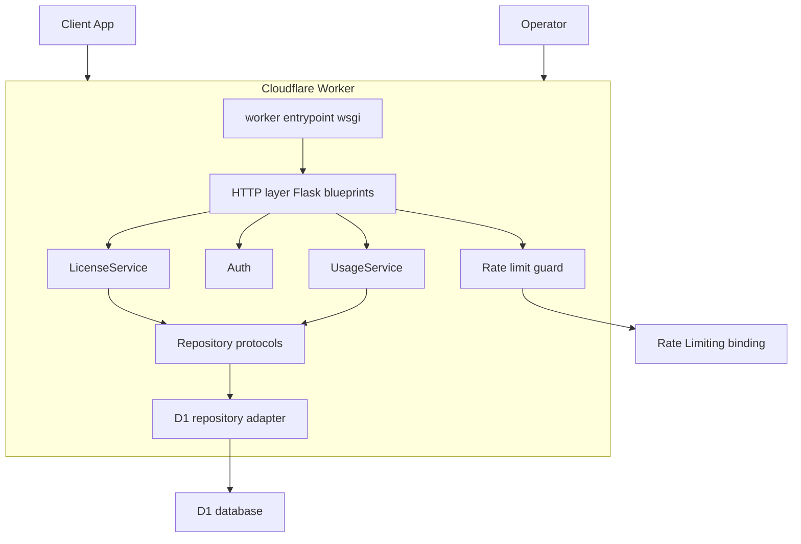
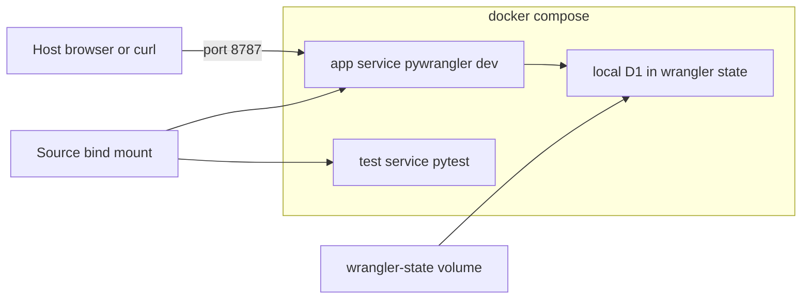
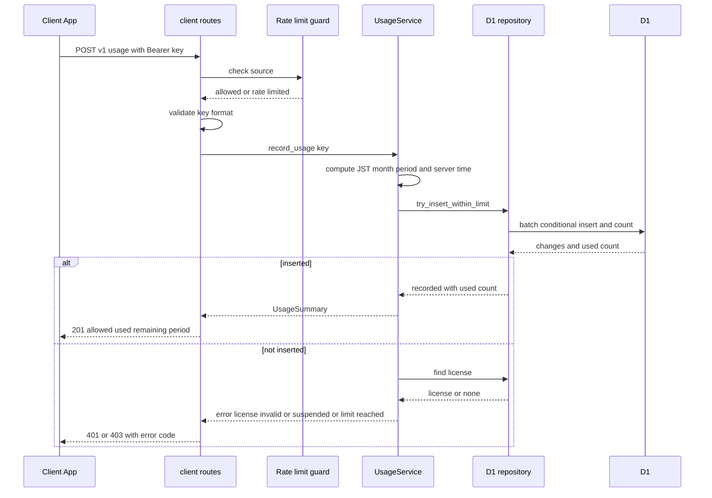
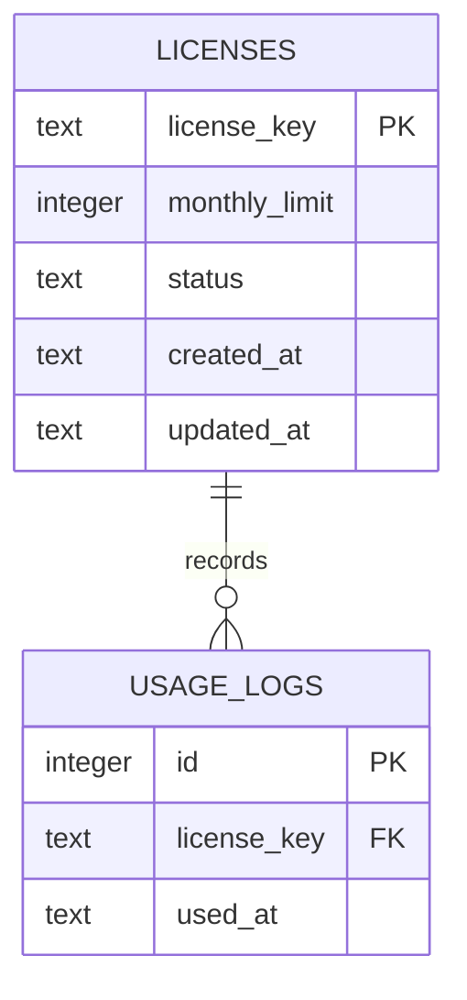

# Technical Design: license-usage-service

## Overview
**Purpose**: 本機能は、利用者端末にインストールされたクライアントアプリに対し、ライセンスの有効性判定と推論回数の記録・月間上限による利用制御を提供する。
**Users**: クライアントアプリは推論実行前に利用を申請し、サービス運営者はライセンスの発行・変更・停止と利用実績の確認を行う。
**Impact**: 新規サービスである。Cloudflare Workers（Python + Flask）と D1 上に構築し、既存システムへの変更はない。

当月の利用回数は保持せず、利用履歴（`usage_logs`）の件数から算出する。上限判定と記録は単一の SQL 文で原子的に行い、同時要求でも上限を超えない。

### Goals
- 推論1回につき利用履歴を1件だけ記録し、ライセンスごとの月間回数を正確に算出する
- 同一ライセンスへの同時要求があっても月間上限を超えない
- クライアントアプリが状況に応じた処理を行えるよう、一貫した応答形式と区別可能なエラー種別を返す

### Non-Goals
- 課金・決済、ライセンス購入画面、エンドユーザー向け管理画面
- クライアントアプリのオフライン時の利用制御
- 再送による二重計上の防止（冪等キー）。未解決事項として扱う
- 管理用 Web UI（初版は API のみ）
- Docker コンテナでの本番運用（Docker はローカル開発・テスト専用。本番は Cloudflare Workers）

## Boundary Commitments

### This Spec Owns
- ライセンス（キー・月間上限・状態）の正本データと、そのライフサイクル（発行・上限変更・停止・再開）
- 利用履歴の正本データと、月間利用回数の算出規則（JST 暦月、半開区間）
- クライアント向け API（有効性確認・利用記録・当月状況照会）と管理 API の契約
- エラー種別と応答エンベロープの定義
- Docker / docker-compose によるローカル開発・テスト環境（`docker compose up` で API とローカル D1 が起動する状態）

### Out of Boundary
- 推論処理そのもの、推論の入力データ・結果の保存（本サービスは受け取らない）
- クライアントアプリ内でのライセンスキーの保管方法と UI 表示
- 運営者アカウント管理（初版は単一の管理トークンのみ）
- 月次レポートの自動生成・通知

### Allowed Dependencies
- Cloudflare Workers Python ランタイム（Pyodide）と `workers` モジュール（`wsgi`, `WorkerEntrypoint`）
- D1 バインディング `DB`、レート制限バインディング `RATE_LIMITER`、Worker Secret `ADMIN_API_TOKEN`
- Flask 3.x
- 依存方向の制約: 下位層は上位層を import しない（Architecture 参照）。`pyodide` / `js` / `workers` への依存は `repository/d1.py`・`http/`・`worker.py` に限定する

### Revalidation Triggers
- API のパス・リクエスト/レスポンス形式・エラーコードの変更（クライアントアプリの改修が必要）
- 月の区切り規則（タイムゾーン・暦月）の変更
- ライセンスキー形式の変更
- 認証方式の変更（Bearer ヘッダー → 別方式）

## Architecture

### Architecture Pattern & Boundary Map



**Architecture Integration**:
- Selected pattern: レイヤード構成＋リポジトリ抽象。サービス層は同期の純 Python とし、D1（非同期 JS API）は `run_sync` を用いるアダプタに閉じ込める。ローカルテストでは同じ Protocol を満たす SQLite フェイクに差し替える。
- Domain/feature boundaries: ライセンス管理（`LicenseService`）と利用記録・集計（`UsageService`）を分離する。`usage_logs` への書き込みは `UsageService` だけが行う。
- Existing patterns preserved: なし（新規）。
- New components rationale: 各コンポーネントの責務は Components and Interfaces を参照。
- Steering compliance: steering 未作成。本設計の方針を後で steering に反映することを推奨する。

**Dependency Direction**（左の層は右の層を import しない。違反はレビューでエラーとして扱う）:

`domain` → `config` → `repository` → `services` → `http` → `worker.py`

- `domain`: 型・エラーコード・期間計算・キー形式（外部依存なし）
- `repository/base.py`: Protocol 定義（`domain` のみに依存）
- `repository/d1.py`: D1 アダプタ（`pyodide.ffi` に依存）
- `services`: `domain` と `repository/base.py` のみに依存（`d1.py` を直接 import しない）
- `http`: Flask・サービス・`config` に依存。リポジトリ実装の生成（D1 アダプタの注入）を担う

### Technology Stack

| Layer | Choice / Version | Role in Feature | Notes |
|-------|------------------|-----------------|-------|
| Backend / Services | Python 3.12+（Pyodide ランタイム）, Flask 3.x | HTTP ルーティング、入力検証、ビジネスロジック | `workers.wsgi.entrypoint` で公開 |
| Data / Storage | Cloudflare D1（SQLite 互換） | ライセンスと利用履歴の永続化、上限判定 | マイグレーションは `wrangler d1 migrations` |
| Infrastructure / Runtime | Cloudflare Workers, pywrangler（`workers-py`）, Wrangler 4.36+ | 実行・ローカル開発・デプロイ | `compatibility_flags: ["python_workers"]` |
| Package / Tooling | uv | 依存関係の管理、仮想環境、コマンド実行 | pip / poetry は使わない。`uv.lock` をコミットする |
| Package / Tooling | Node.js 24 LTS, npm 11（`wrangler` を `package.json` で固定） | pywrangler が内部で呼ぶ `npx wrangler` の実行 | Node パッケージは wrangler のみ |
| Local Environment | Docker, Docker Compose v2 | ローカル開発サーバーとテストの起動 | 本番では使わない |
| Security | Rate Limiting binding, Worker Secret | 乱用防止、管理トークンの保管 | レート制限は拠点ローカル・近似値 |
| Test | pytest, Python 標準 `sqlite3` | 単体・結合テスト（ローカル CPython） | 本番と同じマイグレーション SQL をフェイクに適用 |

**uv の運用規約**:
- 本番依存は `uv add <pkg>`（`[project].dependencies`）、開発依存は `uv add --dev <pkg>`（`[dependency-groups].dev`）で追加する。`pyproject.toml` を手で編集して依存を足さない。
- コマンドはすべて `uv run` 経由で実行する: `uv run pywrangler dev`（ローカル起動）、`uv run pywrangler deploy`（デプロイ）、`uv run pytest`（テスト）、`uv run pywrangler d1 migrations apply DB`（マイグレーション）。
- `uv.lock` をリポジトリにコミットし、`uv sync` で環境を再現する。Python のバージョンは `.python-version` で固定する。

## File Structure Plan

### Directory Structure
```
pyproject.toml                         # uv 管理。依存（flask）と dev グループ（workers-py, workers-runtime-sdk, pytest）
uv.lock                                # uv が生成するロックファイル（コミット対象）
.python-version                        # uv が参照する Python バージョン
package.json / package-lock.json       # wrangler のバージョン固定（pywrangler の npx が参照）
Dockerfile                             # ローカル開発用イメージ（Node.js＋uv＋Python）
docker-compose.yml                     # app（開発サーバー）と test（pytest）サービス
.dockerignore                          # .venv, .venv-workers, python_modules, node_modules, .wrangler などを除外
.dev.vars.example                      # ローカル用 Secret の雛形（ADMIN_API_TOKEN）。実ファイル .dev.vars は gitignore
docker/
└── dev-entrypoint.sh                  # 依存同期 → ローカル D1 マイグレーション → pywrangler dev 起動
wrangler.jsonc                         # main, compatibility flags, d1_databases(DB), ratelimits(RATE_LIMITER)
migrations/
└── 0001_create_licenses_and_usage_logs.sql   # テーブル・インデックス定義（正本スキーマ）
src/
├── worker.py                          # Workers エントリポイント: Default = wsgi.entrypoint(create_app(workers_dependencies))
└── license_server/
    ├── __init__.py
    ├── app.py                         # create_app(dependencies): Blueprint 登録、アクセスログ、共通エラーハンドラ
    ├── config.py                      # バインディング・Secret の取得（request.environ["workers.env"] 経由）
    ├── domain/
    │   ├── types.py                   # License, UsageSummary, Period などのデータクラスと列挙
    │   ├── errors.py                  # ErrorCode 列挙と ServiceError 例外
    │   ├── period.py                  # JST 暦月の半開区間計算、UTC 時刻文字列の生成、入力時刻・月の解析
    │   └── license_key.py             # キー生成・形式検証・ログ用フィンガープリント
    ├── repository/
    │   ├── base.py                    # LicenseRepository / UsageRepository Protocol、例外、InsertResult
    │   ├── sql.py                     # D1 とテスト用 SQLite で共有する SQL と行変換
    │   └── d1.py                      # D1 実装（run_sync で非同期 API を同期化）
    ├── services/
    │   ├── common.py                  # Clock 型、ensure_active / ensure_exists
    │   ├── license_service.py         # 有効性判定、発行・参照・変更・停止・再開
    │   └── usage_service.py           # 利用記録（上限判定込み）、当月状況、履歴参照
    └── http/
        ├── dependencies.py            # Dependencies（サービス・レート制限・管理トークン）のリクエスト単位の生成とガード
        ├── access_log.py              # 構造化アクセスログ（JSON 1 行を stdout へ）
        ├── dto.py                     # ドメイン型 → 応答 JSON の変換
        ├── responses.py               # 成功・失敗エンベロープ、ErrorCode→HTTP ステータス対応
        ├── auth.py                    # Bearer 抽出、管理トークンの定数時間比較
        ├── rate_limit.py              # RateLimiter Protocol、Workers バインディングのアダプタ、ガード
        ├── client_routes.py           # /v1/licenses/verify, /v1/usage, /v1/usage/current
        └── admin_routes.py            # /v1/admin/*
scripts/
├── smoke_flow.sh                      # 開発サーバーに対する curl の通し確認（発行→確認→記録→停止→再開）
└── concurrency_check.py               # 上限 10 に 30 件を並行送信し、成功がちょうど 10 件になることを確認
tests/
├── fakes/
│   ├── sqlite_repository.py           # 標準 sqlite3 による Protocol 実装（マイグレーション SQL と sql.py を使用）
│   └── fake_d1.py                     # D1 バインディングの最小フェイク（D1Repository の単体テスト用）
├── contract/                          # SqliteRepository がリポジトリ契約を満たすことのテスト
├── unit/                              # domain・repository・services・http 部品・設定ファイルの単体テスト
└── integration/                       # Flask テストクライアント＋フェイクによる API・シナリオ・ログのテスト
```

### Modified Files
- `.gitignore` — `.venv/`, `.venv-workers/`, `python_modules/`, `.wrangler/`, `node_modules/`, `.dev.vars` などの生成物が未登録なら追加する（`uv.lock` と `package-lock.json` は除外しない）

## Local Development Environment（Docker / docker-compose）

本番は Cloudflare Workers で動かし、Docker はローカルで同じ Workers ランタイム（`wrangler dev` が使う workerd とローカル D1）を起動するためだけに使う。ホストに uv・Node.js・Python を入れなくても開発とテストができる状態を目標とする。



**イメージ（`Dockerfile`）**
- ベースは `node:24-bookworm-slim`（workerd が glibc を必要とするため Alpine は使わない。`package.json` の `allowScripts` を解釈する npm 11 に合わせる）。uv は公式イメージ `ghcr.io/astral-sh/uv` からバイナリをコピーし、Python はテスト用の 3.13 と Workers バンドル用の 3.14 を `uv python install` で入れる。
- ビルド時に `uv sync`（dev グループ込み）、`uv run pywrangler sync`、`npm ci` を実行し、起動のたびに依存をダウンロードしないようにする。
- 環境変数: `UV_PROJECT_ENVIRONMENT=/opt/venv`（ホスト側 `.venv` と衝突させない）、`UV_LINK_MODE=copy`、`UV_FROZEN=1`。
- amd64 / arm64（Apple Silicon）の両方でビルドできること。

**サービス（`docker-compose.yml`）**

| Service | Command | Ports | 用途 |
|---------|---------|-------|------|
| app | `docker/dev-entrypoint.sh` | `8787:8787` | 開発サーバー。`docker compose up` で起動 |
| test | `uv run pytest` | なし | テスト。`docker compose run --rm test` で実行（`profiles: [test]` で `up` 時は起動しない） |

**ボリューム**
- ソースコード: `.:/app` をバインドマウントし、変更を `wrangler dev` の自動再読み込みで反映する。
- プラットフォーム依存の生成物はホストに書き出さないよう、名前付きボリュームで上書きマウントする: `/app/.wrangler`（ローカル D1 のデータ。再起動しても保持）、`/app/.venv-workers`、`/app/node_modules`、uv キャッシュ。
- `python_modules` はボリュームにしない。pywrangler は再同期のたびに `rmtree(python_modules)` で作り直すため、マウントポイントだと `EBUSY` で起動に失敗する。中身は OS 非依存の Pyodide 向けパッケージで、gitignore 済みのためバインドマウント内に置く。
- ローカル D1 を初期化したいときは `docker compose down -v` でボリュームごと削除する。

**起動処理（`docker/dev-entrypoint.sh`）**
1. `uv sync`（`pyproject.toml` が変わっていた場合に備える）
2. `uv run pywrangler d1 migrations apply DB --local`（未適用のマイグレーションだけを適用）
3. `exec uv run pywrangler dev --ip 0.0.0.0 --port 8787`（コンテナ外から接続できるよう全インターフェースで待ち受ける）

**Secret とヘルスチェック**
- `ADMIN_API_TOKEN` はプロジェクト直下の `.dev.vars` から wrangler が読み込む。`.dev.vars.example` をコピーして作る。
- `GET /healthz` を追加する（認証・レート制限・DB アクセスなし。`{"ok": true, "data": {"status": "ok"}}` を返す）。compose の `healthcheck` はこれを使う。

**範囲外**
- コンテナからの本番デプロイ（`uv run pywrangler deploy` はホストまたは CI で実行する。コンテナで行う場合は `CLOUDFLARE_API_TOKEN` を環境変数で渡す）。

## System Flows

### 推論利用の記録（`POST /v1/usage`）



**Key Decisions**:
- 上限判定と挿入は単一の条件付き `INSERT … SELECT` で行い、挿入件数（`meta.changes`）で許可を判定する。D1 はステートメントを逐次実行するため、同時要求でも上限を超えない（3.3）。
- 記録後の当月件数は、挿入と同じ `batch()`（トランザクション）内の COUNT で取得する（2.2）。
- 拒否時のみ追加の読み取りで理由を判定する。成功時の往復は `batch()` 1 回で済む。
- 利用日時はサーバー時刻で決め、リクエストボディの時刻は受け付けない（2.3）。

## Requirements Traceability

| Requirement | Summary | Components | Interfaces | Flows |
|-------------|---------|------------|------------|-------|
| 1.1 | 有効キーで有効性と上限を返す | LicenseService, client_routes | `POST /v1/licenses/verify` | — |
| 1.2 | 未登録キーはライセンス無効 | LicenseService, responses | `license_invalid` | — |
| 1.3 | 停止中キーは利用停止中 | LicenseService, responses | `license_suspended` | — |
| 1.4 | キー欠落・形式不正は要求不正 | auth, license_key | `invalid_request` | — |
| 1.5 | 無効キー応答で他ライセンスの情報を出さない | responses | 固定メッセージ | — |
| 2.1 | 条件を満たせば履歴を1件追加 | UsageService, D1Repository | `POST /v1/usage` | 利用記録 |
| 2.2 | 許可・当月回数・残り回数を返す | UsageService | `UsageSummary` | 利用記録 |
| 2.3 | サーバー時刻で記録 | UsageService, period | — | 利用記録 |
| 2.4 | 無効・停止中キーは追加せずエラー | UsageService | 条件付き INSERT | 利用記録 |
| 2.5 | 保存失敗時は不許可＋一時的障害 | D1Repository, responses | `temporary_failure` | 利用記録 |
| 2.6 | 推論データを保存しない | usage_logs スキーマ, client_routes | リクエストはボディ不要 | — |
| 3.1 | 当月件数＝当月履歴件数 | UsageService, period | COUNT（半開区間） | — |
| 3.2 | 上限到達時は追加せずエラー | UsageService | `monthly_limit_reached` | 利用記録 |
| 3.3 | 同時要求でも上限を超えない | D1Repository | 単一文の条件付き INSERT | 利用記録 |
| 3.4 | 前月分を含めない | period | JST 暦月の半開区間 | — |
| 3.5 | 上限変更を以降の判定に反映 | UsageService, D1Repository | 判定時に licenses を参照 | — |
| 4.1 | 当月回数・上限・残り・期間を返す | UsageService | `GET /v1/usage/current` | — |
| 4.2 | 照会で履歴を追加しない | UsageService | 読み取りのみ | — |
| 4.3 | 無効・停止中は状況を返さない | UsageService, LicenseService | `license_invalid` / `license_suspended` | — |
| 5.1 | 重複しないキーで発行 | LicenseService, license_key | `POST /v1/admin/licenses` | — |
| 5.2 | 上限の変更 | LicenseService | `POST /v1/admin/licenses/update-limit` | — |
| 5.3 | 無効化 | LicenseService | `POST /v1/admin/licenses/suspend` | — |
| 5.4 | 再有効化 | LicenseService | `POST /v1/admin/licenses/activate` | — |
| 5.5 | 上限値の検証 | admin_routes, LicenseService | `invalid_request` | — |
| 5.6 | 無効化で履歴を削除しない | スキーマ（FK RESTRICT）, LicenseService | 削除 API なし | — |
| 6.1 | 期間指定の履歴一覧 | UsageService | `POST /v1/admin/usage/logs` | — |
| 6.2 | 月別回数 | UsageService, period | `POST /v1/admin/usage/monthly` | — |
| 6.3 | クライアントに履歴の変更手段を与えない | client_routes | 更新・削除 API なし | — |
| 7.1 | 管理機能は運営者認証必須 | auth, admin_routes | `unauthorized` | — |
| 7.2 | 暗号化通信のみ | wrangler 設定, app | HTTPS 必須 | — |
| 7.3 | 繰り返し要求の制限 | rate_limit | `rate_limited` | 利用記録 |
| 7.4 | キー・認証情報をログに出さない | license_key, auth | フィンガープリント | — |
| 8.1 | 一貫した応答形式 | responses, app | エンベロープ | — |
| 8.2 | エラー種別の区別 | errors, responses | `ErrorCode` | — |
| 8.3 | 内部エラーの詳細を隠す | app, responses | `temporary_failure` | — |

## Components and Interfaces

| Component | Domain/Layer | Intent | Req Coverage | Key Dependencies (P0/P1) | Contracts |
|-----------|--------------|--------|--------------|--------------------------|-----------|
| domain（types / errors / period / license_key） | Domain | 型・エラーコード・期間計算・キー形式 | 1.4, 2.3, 3.1, 3.4, 5.1, 7.4, 8.2 | なし | Service |
| D1Repository | Repository | D1 への永続化と原子的な上限判定付き挿入 | 2.1, 2.5, 3.3, 3.5, 5.6 | D1 binding (P0) | Service |
| LicenseService | Services | 有効性判定とライセンスのライフサイクル | 1.1–1.3, 4.3, 5.1–5.6 | LicenseRepository (P0) | Service |
| UsageService | Services | 利用記録・当月状況・履歴参照 | 2.1–2.4, 3.1–3.5, 4.1–4.3, 6.1, 6.2 | UsageRepository (P0), LicenseRepository (P0) | Service |
| client_routes | HTTP | クライアント向け API | 1.x, 2.x, 4.x, 6.3 | UsageService (P0), LicenseService (P0), auth (P0), rate_limit (P1) | API |
| admin_routes | HTTP | 管理 API | 5.x, 6.1, 6.2, 7.1 | LicenseService (P0), UsageService (P0), auth (P0) | API |
| auth | HTTP | Bearer 抽出と管理トークン検証 | 1.4, 7.1, 7.4 | config (P0) | Service |
| rate_limit | HTTP | 送信元単位の乱用防止 | 7.3 | Rate Limiting binding (P1) | Service |
| responses / app | HTTP | エンベロープと共通エラー処理 | 1.5, 2.5, 8.1–8.3 | errors (P0) | API |

### Domain

#### domain（types / errors / period / license_key）

| Field | Detail |
|-------|--------|
| Intent | 外部依存を持たない型定義・規則の集約 |
| Requirements | 1.4, 2.3, 3.1, 3.4, 5.1, 7.4, 8.2 |

**Responsibilities & Constraints**
- `period`: 与えられた UTC 時刻から JST 暦月の半開区間 `[月初 00:00 JST, 翌月初 00:00 JST)` を UTC 固定長文字列で返す。JST は UTC+9 固定オフセットで扱い、`zoneinfo` に依存しない。
- `license_key`: キーは `lk_` ＋ 32 桁の小文字 16 進数（128 ビット乱数、`secrets` で生成）。形式検証は正規表現 `^lk_[0-9a-f]{32}$`。ログ用に SHA-256 先頭 8 桁のフィンガープリントを返す。
- `errors`: `ErrorCode` 列挙と、コードとメッセージを持つ `ServiceError` 例外。

**Contracts**: Service [x]

##### Service Interface
```python
class LicenseStatus(StrEnum):
    ACTIVE = "active"
    SUSPENDED = "suspended"

class ErrorCode(StrEnum):
    INVALID_REQUEST = "invalid_request"
    LICENSE_INVALID = "license_invalid"
    LICENSE_SUSPENDED = "license_suspended"
    MONTHLY_LIMIT_REACHED = "monthly_limit_reached"
    UNAUTHORIZED = "unauthorized"
    LICENSE_NOT_FOUND = "license_not_found"   # 管理 API で対象キーが存在しない
    RATE_LIMITED = "rate_limited"
    TEMPORARY_FAILURE = "temporary_failure"

class ServiceError(Exception):
    code: ErrorCode
    message: str

@dataclass(frozen=True)
class License:
    license_key: str
    monthly_limit: int
    status: LicenseStatus
    created_at: str
    updated_at: str

@dataclass(frozen=True)
class Period:
    start_utc: str   # 含む
    end_utc: str     # 含まない

@dataclass(frozen=True)
class UsageSummary:
    used: int
    monthly_limit: int
    remaining: int   # max(monthly_limit - used, 0)
    period: Period

def month_period(now_utc: datetime) -> Period: ...
def month_period_of(year: int, month: int) -> Period: ...
def to_utc_text(moment: datetime) -> str: ...        # "YYYY-MM-DDTHH:MM:SS.mmmZ"
def parse_timestamp(value: str) -> str: ...          # オフセット必須の ISO 8601 → UTC 文字列。不正は ValueError
def parse_month(value: str) -> tuple[int, int]: ...  # "YYYY-MM" → (year, month)。不正は ValueError
def generate_license_key() -> str: ...
def is_valid_license_key(value: str) -> bool: ...
def key_fingerprint(license_key: str) -> str: ...
```

### Repository

#### LicenseRepository / UsageRepository（Protocol）と D1Repository

| Field | Detail |
|-------|--------|
| Intent | ライセンスと利用履歴の永続化。上限判定付き挿入を原子的に行う |
| Requirements | 2.1, 2.5, 3.3, 3.5, 5.6 |

**Responsibilities & Constraints**
- `try_insert_within_limit` は、ライセンスが存在し `status = 'active'` かつ当月件数が `monthly_limit` 未満のときだけ 1 行挿入する単一の `INSERT … SELECT` 文と、挿入後の当月件数と `monthly_limit` を返す `COUNT_AND_LIMIT` 文を 1 回の `batch()` で実行する（成功時の応答組み立てに追加の往復を要さない）。
- SQL は `repository/sql.py` に集約し、D1 実装とテスト用 SQLite 実装で同じ文（`?1` 形式のパラメータ、`RETURNING`）を使う。
- D1 の例外はすべて `RepositoryUnavailable` に変換して上位へ送る（詳細はログのみ）。
- 行の削除操作は提供しない。
- D1 アダプタだけが `pyodide.ffi.run_sync` を扱う。結果は `workers` SDK が Python 値に自動変換する（`first()` は dict、`batch()` は `list[dict]`）ため、`.to_py()` は使わない。

**Dependencies**
- Inbound: LicenseService, UsageService — 永続化 (P0)
- External: D1 binding `DB` — `prepare` / `bind` / `batch` / `first` / `all` (P0)

**Contracts**: Service [x] / State [x]

##### Service Interface
```python
class RepositoryUnavailable(Exception): ...
class DuplicateLicenseKey(Exception): ...   # create 時の主キー重複

@dataclass(frozen=True)
class InsertResult:
    inserted: bool
    used_after: int             # 挿入を試みた後の当月件数
    monthly_limit: int | None   # 同じ batch で読んだ上限（ライセンス未登録なら None）

@dataclass(frozen=True)
class UsageLogEntry:
    id: int
    used_at: str

class LicenseRepository(Protocol):
    def find(self, license_key: str) -> License | None: ...
    def create(self, license_key: str, monthly_limit: int, now_utc: str) -> License: ...
    def update_limit(self, license_key: str, monthly_limit: int, now_utc: str) -> License | None: ...
    def set_status(self, license_key: str, status: LicenseStatus, now_utc: str) -> License | None: ...

class UsageRepository(Protocol):
    def try_insert_within_limit(self, license_key: str, used_at: str, period: Period) -> InsertResult: ...
    def count_in_period(self, license_key: str, period: Period) -> int: ...
    def list_in_range(self, license_key: str, start_utc: str, end_utc: str,
                      after_id: int | None, limit: int) -> list[UsageLogEntry]: ...
```
- Preconditions: `license_key` は形式検証済み。`period.start_utc < period.end_utc`。
- Postconditions: `try_insert_within_limit` が `inserted=True` を返した場合、挿入後の当月件数は `monthly_limit` 以下である。
- Invariants: 任意の時点で、ライセンスの当月件数は（上限を下げた場合を除き）`monthly_limit` を超えない。

##### State Management
- Persistence & consistency: D1 プライマリのみを使用し、Sessions API（読み取りレプリカ）は使わない。
- Concurrency strategy: D1 のステートメント逐次実行と単一文の条件付き挿入により直列化する。アプリ側のロックは持たない。

**Implementation Notes**
- Integration: バインディングは `request.environ["workers.env"].DB` から取得し、リクエストごとにアダプタを生成する。
- Validation: `create` のキー重複（`UNIQUE constraint failed`）は `DuplicateLicenseKey` に変換し、呼び出し側で再生成して再試行する（最大 3 回、使い切ったら `RepositoryUnavailable`）。
- Risks: `run_sync` の挙動と `COUNT_AND_LIMIT` を含む batch は `pywrangler dev` のローカル D1 で検証済み。

### Services

#### LicenseService

| Field | Detail |
|-------|--------|
| Intent | ライセンスの有効性判定とライフサイクル管理 |
| Requirements | 1.1, 1.2, 1.3, 4.3, 5.1, 5.2, 5.3, 5.4, 5.5, 5.6 |

**Responsibilities & Constraints**
- `require_active` は、未登録なら `LICENSE_INVALID`、停止中なら `LICENSE_SUSPENDED` を送出する。クライアント向け処理の共通前提として使う。
- 月間上限は 0 以上の整数（上限値は 1,000,000）。`bool` は整数として受け付けない。
- 無効化は状態変更のみで、利用履歴には触れない。

**Contracts**: Service [x]

##### Service Interface
```python
class LicenseService:
    def __init__(self, licenses: LicenseRepository, clock: Callable[[], datetime],
                 key_generator: Callable[[], str] = generate_license_key) -> None: ...
    def require_active(self, license_key: str) -> License: ...
    def get(self, license_key: str) -> License: ...                 # 管理用。停止中でも返す
    def issue(self, monthly_limit: object) -> License: ...          # 値はサービス側で検証する
    def update_limit(self, license_key: str, monthly_limit: object) -> License: ...
    def suspend(self, license_key: str) -> License: ...
    def activate(self, license_key: str) -> License: ...
```
- 管理操作で対象が存在しない場合は `LICENSE_NOT_FOUND` を送出する。
- 停止中への `suspend`、有効への `activate` は冪等に成功する。

#### UsageService

| Field | Detail |
|-------|--------|
| Intent | 利用記録（上限判定込み）、当月状況の照会、履歴参照 |
| Requirements | 2.1, 2.2, 2.3, 2.4, 3.1, 3.2, 3.3, 3.4, 3.5, 4.1, 4.2, 4.3, 6.1, 6.2 |

**Responsibilities & Constraints**
- `record_usage` は、注入された時計から利用日時と当月期間を決め、`try_insert_within_limit` を 1 回呼ぶ。挿入されなければ `LicenseRepository.find` で理由を判定し、未登録→`LICENSE_INVALID`、停止中→`LICENSE_SUSPENDED`、それ以外→`MONTHLY_LIMIT_REACHED` を送出する。
- `current_summary` は読み取りのみで、履歴を追加しない。
- `usage_logs` への書き込みはこのサービスだけが行う。

**Contracts**: Service [x]

##### Service Interface
```python
class UsageService:
    def __init__(self, usage: UsageRepository, licenses: LicenseRepository,
                 clock: Callable[[], datetime]) -> None: ...
    def record_usage(self, license_key: str) -> UsageSummary: ...
    def current_summary(self, license_key: str) -> UsageSummary: ...
    def monthly_count(self, license_key: str, year: int, month: int) -> UsageSummary: ...
    def list_logs(self, license_key: str, start_utc: str, end_utc: str,
                  after_id: int | None, limit: int) -> tuple[list[UsageLogEntry], int | None]: ...
```
- `list_logs` の戻り値の2要素目は次ページ用カーソル（最後の `id`、続きがなければ `None`）。`limit` は 1〜1000、既定 100。
- `monthly_count` と `list_logs` は管理 API 専用で、ライセンスの状態に関わらず（停止中でも）結果を返す。

### HTTP

#### client_routes / admin_routes

| Field | Detail |
|-------|--------|
| Intent | HTTP 契約の提供、入力検証、認証・レート制限の適用 |
| Requirements | 1.x, 2.x, 4.x, 5.x, 6.x, 7.1, 7.3 |

**Responsibilities & Constraints**
- クライアント API はライセンスキーを `Authorization: Bearer <license_key>` で受け取る。
- 管理 API は `Authorization: Bearer <ADMIN_API_TOKEN>` を必須とし、対象ライセンスキーは JSON ボディで受け取る。
- ライセンスキーを URL のパスやクエリに含めない（Workers のリクエストログに残るため）。
- `/healthz` を除く全ルートで、処理の最初にレート制限ガードを適用する。

**Dependencies**
- Outbound: LicenseService, UsageService (P0), auth (P0), rate_limit (P1)
- External: Flask (P0)

**Contracts**: API [x]

##### API Contract

クライアント API（`Authorization: Bearer <license_key>`）:

| Method | Endpoint | Request | Response | Errors |
|--------|----------|---------|----------|--------|
| POST | /v1/licenses/verify | ボディなし | 200 `{valid, monthly_limit, status}` | 400, 401, 403, 429, 503 |
| POST | /v1/usage | ボディなし（送られても無視） | 201 `UsageSummaryDTO` ＋ `allowed: true` | 400, 401, 403, 429, 503 |
| GET | /v1/usage/current | なし | 200 `UsageSummaryDTO` | 400, 401, 403, 429, 503 |

管理 API（`Authorization: Bearer <ADMIN_API_TOKEN>`）:

| Method | Endpoint | Request | Response | Errors |
|--------|----------|---------|----------|--------|
| POST | /v1/admin/licenses | `{monthly_limit}` | 201 `LicenseDTO` | 400, 401, 429, 503 |
| POST | /v1/admin/licenses/get | `{license_key}` | 200 `LicenseDTO` | 400, 401, 404, 429, 503 |
| POST | /v1/admin/licenses/update-limit | `{license_key, monthly_limit}` | 200 `LicenseDTO` | 400, 401, 404, 429, 503 |
| POST | /v1/admin/licenses/suspend | `{license_key}` | 200 `LicenseDTO` | 400, 401, 404, 429, 503 |
| POST | /v1/admin/licenses/activate | `{license_key}` | 200 `LicenseDTO` | 400, 401, 404, 429, 503 |
| POST | /v1/admin/usage/logs | `{license_key, from, to, after_id?, limit?}` | 200 `{entries: [{id, used_at}], next_after_id}` | 400, 401, 404, 429, 503 |
| POST | /v1/admin/usage/monthly | `{license_key, month: "YYYY-MM"}` | 200 `UsageSummaryDTO` | 400, 401, 404, 429, 503 |

運用 API（認証なし）:

| Method | Endpoint | Request | Response | Errors |
|--------|----------|---------|----------|--------|
| GET | /healthz | なし | 200 `{status: "ok"}` | — |

- `/healthz` はレート制限・DB アクセスの対象外とし、docker-compose のヘルスチェックに使う。
- `from` / `to` は ISO 8601（タイムゾーン必須）で受け取り、UTC に正規化して半開区間 `[from, to)` として扱う。
- 管理 API は参照系も POST とする（ライセンスキーを URL に載せないため）。

#### auth

| Field | Detail |
|-------|--------|
| Intent | 認証情報の抽出と検証 |
| Requirements | 1.4, 7.1, 7.4 |

**Contracts**: Service [x]

##### Service Interface
```python
def extract_license_key(authorization: str | None) -> str: ...   # 欠落・形式不正は INVALID_REQUEST
def require_admin(authorization: str | None, expected_token: str | None) -> None: ...  # 不一致は UNAUTHORIZED
```
- 管理トークンの比較は `hmac.compare_digest` による定数時間比較とする。
- `ADMIN_API_TOKEN` が未設定の場合、管理 API は常に `UNAUTHORIZED` を返す（フェイルクローズ）。
- ログにはライセンスキーの代わりに `key_fingerprint` を出力し、`Authorization` ヘッダーは出力しない。

#### rate_limit

| Field | Detail |
|-------|--------|
| Intent | 送信元単位の粗い乱用防止 |
| Requirements | 7.3 |

**Responsibilities & Constraints**
- キーは `CF-Connecting-IP` ヘッダーの値。`RATE_LIMITER.limit({key})` が `success=false` なら `RATE_LIMITED`（429）を返す。
- 上限は `wrangler.jsonc` の `ratelimits` で設定する（初期値: 60 秒あたり 120 回）。
- レート制限バインディングが未設定・エラーの場合は制限せずに処理を続行する（可用性を優先）。
- Rate Limiting API は「残量の確認だけ」ができないため、無効キーの要求だけを数えるのではなく、全要求をライセンス照合の前に数える。総当たりへの耐性は主に 128 ビットのキー空間で確保する。

**Contracts**: Service [x]

##### Service Interface
```python
class RateLimiter(Protocol):
    def limit(self, key: str) -> bool: ...          # True なら許可

class WorkersRateLimiter:                            # RATE_LIMITER バインディングのアダプタ
    def __init__(self, binding: Any, run_sync: Callable[[Any], Any] = ...) -> None: ...
    def limit(self, key: str) -> bool: ...          # run_sync(binding.limit({"key": key}))["success"]

def enforce_rate_limit(limiter: RateLimiter | None, source_ip: str | None) -> None: ...  # 超過時 RATE_LIMITED
```
- `binding.limit` には Python の dict をそのまま渡せる（ローカルの workerd で 120 回目以降に 429 となることを確認済み）。
- 送信元 IP が取れない場合のキーは `"unknown"`。

#### dependencies

- `create_app(dependencies: Callable[[], Dependencies] | None)` にファクトリを渡し、ルートは `current()` で取得する（`flask.g` に 1 リクエスト 1 回だけ生成）。
- 本番のファクトリ `workers_dependencies` は `config.bindings_from_environ` で `DB`・`RATE_LIMITER`・`ADMIN_API_TOKEN` を取り出し、`D1Repository`・各サービス・`WorkersRateLimiter` を生成する。テストでは SQLite フェイクと固定時計を使うファクトリを渡す。
- `guard_client()` はレート制限 → Bearer 抽出の順、`guard_admin()` はレート制限 → 管理トークン検証の順で適用する。

#### responses / app

| Field | Detail |
|-------|--------|
| Intent | 応答エンベロープと共通エラー処理 |
| Requirements | 1.5, 2.5, 8.1, 8.2, 8.3 |

**Responsibilities & Constraints**
- 成功: `{"ok": true, "data": {...}}`。失敗: `{"ok": false, "error": {"code": "<ErrorCode>", "message": "<固定文言>"}}`。
- `ServiceError` はコードに応じた HTTP ステータスへ変換する。`RepositoryUnavailable` とその他の想定外例外は `TEMPORARY_FAILURE`（503）に変換し、スタックトレースや SQL は応答に含めない。
- Flask の 404 / 405 も同じエンベロープ（`invalid_request`）で返す。
- 本番環境では HTTP を受け付けない（Workers のカスタムドメインで「Always Use HTTPS」を有効にし、`workers.dev` は無効化）。

**Contracts**: API [x]

## Data Models

### Domain Model
- 集約ルートは `License`。`UsageLog` は `License` に従属する追記専用のイベントである。
- 不変条件: 当月の `UsageLog` 件数 ≤ `License.monthly_limit`（上限を下げた場合は、既存の件数が新上限を超えることを許容し、以降の記録を拒否する）。
- 当月件数は保持せず、常に `UsageLog` から導出する。



### Physical Data Model

`migrations/0001_create_licenses_and_usage_logs.sql` の内容（正本）:

**licenses**

| Column | Type | Constraint | Notes |
|--------|------|------------|-------|
| license_key | TEXT | PRIMARY KEY | `lk_` ＋ 32 桁 16 進数 |
| monthly_limit | INTEGER | NOT NULL, CHECK (monthly_limit >= 0) | 月間上限回数 |
| status | TEXT | NOT NULL DEFAULT 'active', CHECK (status IN ('active','suspended')) | 設計案からの追加 |
| created_at | TEXT | NOT NULL | UTC 固定長 ISO 8601 |
| updated_at | TEXT | NOT NULL | UTC 固定長 ISO 8601 |

**usage_logs**

| Column | Type | Constraint | Notes |
|--------|------|------------|-------|
| id | INTEGER | PRIMARY KEY AUTOINCREMENT | 自動採番 |
| license_key | TEXT | NOT NULL, REFERENCES licenses(license_key) ON DELETE RESTRICT | |
| used_at | TEXT | NOT NULL, CHECK (strftime('%Y-%m-%dT%H:%M:%fZ', used_at) IS used_at) | UTC 固定長 ISO 8601（サーバー時刻）。形式外の値と存在しない日付を拒否する |

**Indexes**
- `idx_usage_logs_license_used_at ON usage_logs(license_key, used_at)` — 当月件数の COUNT と期間検索を範囲走査に限定する。

**Consistency & Integrity**
- 利用記録の上限判定と挿入は単一文で行い、挿入後件数の取得は同じ `batch()` 内で行う。
- `licenses` の行は削除しない（削除 API を持たない。FK の `RESTRICT` で履歴の孤立も防ぐ）。
- 時刻はすべて `YYYY-MM-DDTHH:MM:SS.mmmZ` の固定長で保存し、文字列比較で範囲検索する。

### Data Contracts & Integration

```python
class LicenseDTO(TypedDict):
    license_key: str
    monthly_limit: int
    status: Literal["active", "suspended"]
    created_at: str
    updated_at: str

class PeriodDTO(TypedDict):
    start: str          # UTC ISO 8601（含む）
    end: str            # UTC ISO 8601（含まない）
    timezone: Literal["Asia/Tokyo"]

class UsageSummaryDTO(TypedDict):
    used: int
    monthly_limit: int
    remaining: int
    period: PeriodDTO
```
- シリアライズは JSON（UTF-8）。API バージョンはパス接頭辞 `/v1` で管理し、破壊的変更時は `/v2` を追加する。

## Error Handling

### Error Strategy
- 入力は HTTP 層で早期に検証し（Fail Fast）、ビジネス規則違反はサービス層で `ServiceError` として送出する。
- 永続化の失敗は利用を許可しない方向に倒す（2.5）。クライアントアプリは `temporary_failure` を受けたら推論を実行せず、再試行を案内する。

### Error Categories and Responses

| ErrorCode | HTTP | 発生条件 | 要件 |
|-----------|------|----------|------|
| invalid_request | 400 | キー欠落・形式不正、ボディ不正、上限値不正、未定義パス | 1.4, 5.5 |
| license_invalid | 401 | 未登録キー（固定文言で、他ライセンスの情報を含めない） | 1.2, 1.5, 2.4, 4.3 |
| unauthorized | 401 | 管理トークンの欠落・不一致 | 7.1 |
| license_suspended | 403 | 停止中ライセンス | 1.3, 2.4, 4.3 |
| monthly_limit_reached | 403 | 当月件数が上限に到達 | 3.2 |
| license_not_found | 404 | 管理 API の対象が存在しない | 5.x, 6.x |
| rate_limited | 429 | 送信元単位のレート制限超過 | 7.3 |
| temporary_failure | 503 | D1 障害・想定外例外 | 2.5, 8.3 |

クライアントアプリは HTTP ステータスではなく `error.code` で分岐する（401 と 403 はそれぞれ複数の意味を持つため）。

### Monitoring
- Workers Logs（Observability）を有効化し、エラーコード・ルート・キーのフィンガープリント・処理時間を構造化ログで出力する。キー本体と `Authorization` ヘッダーは出力しない。
- 出力は `after_request` で 1 リクエスト 1 行の JSON を stdout に書く（Workers Logs が JSON をフィールドとして取り込む）。形式: `{"event": "request", "method", "route"（URL ルールのテンプレート。未定義パスは null）, "status", "error_code", "key_fingerprint", "duration_ms"}`。
- `temporary_failure` と `rate_limited` の発生件数を監視対象とする。

## Testing Strategy

テストはすべて `uv run pytest` で実行する。Docker では `docker compose run --rm test` が同じコマンドを実行する。

- **Unit Tests**
  - `month_period`: JST の月末 23:59:59.999 と月初 00:00 の境界、UTC では前日にあたる時刻、12月→1月の年またぎ
  - `license_key`: 生成値が形式に一致すること、形式外の値の拒否、フィンガープリントからキーが復元できないこと
  - `UsageService.record_usage`: 挿入成功時の残り回数、拒否時の理由判定（未登録・停止中・上限到達）
  - `LicenseService`: 上限値の検証（負数・小数・bool・上限超過）、停止・再開の冪等性
  - `auth.require_admin`: トークン未設定時のフェイルクローズ
- **Integration Tests**（Flask テストクライアント＋SQLite フェイク。本番と同じマイグレーション SQL を適用）
  - 上限 N のライセンスで N 回成功し、N+1 回目が `monthly_limit_reached` になり、履歴が N 件であること
  - 停止→記録拒否→再開→記録成功、および停止後も履歴が残ること
  - 上限変更が直後の判定に反映されること
  - すべてのエラーがエンベロープ形式で返り、内部情報を含まないこと（D1 例外を模擬）
  - 管理 API が管理トークンなしで 401 を返すこと
- **Runtime Tests**（`docker compose up` で起動した `pywrangler dev`＋ローカル D1）
  - Flask＋`run_sync`＋D1 の疎通（初期タスクで実施）
  - `docker compose up` 後に `GET /healthz` が 200 を返し、ホストの `localhost:8787` から API を呼べること（`scripts/smoke_flow.sh`）
  - 同一ライセンスへの並行要求（上限 10 に対し 30 並列）で履歴が 10 件を超えないこと（`uv run python scripts/concurrency_check.py`）

## Security Considerations
- 医療現場で使われるアプリのため、推論の入力データ・結果（心電図データ等）を受け取らない API 形状とする（2.6）。利用記録リクエストはボディ不要。
- ライセンスキーは 128 ビット乱数で、推測による総当たりは現実的でない。レート制限は補助策とする。
- 管理トークンは Worker Secret（`wrangler secret put ADMIN_API_TOKEN`）で管理し、リポジトリに含めない。将来、Cloudflare Access を `/v1/admin/*` の前段に追加できる。
- ライセンスキーは D1 に平文で保存する（ユーザーの設計案どおり `usage_logs.license_key` で参照するため）。D1 へのアクセス権限はデプロイ担当者に限定する。

## Performance & Scalability
- 利用記録は D1 への `batch()` 1 往復で完了する（拒否時のみ追加で 1 往復）。
- 当月件数の COUNT は複合インデックスで当該ライセンス・当月範囲のみを走査する。月間上限が数万回規模でも許容範囲と想定する。
- 将来、履歴が大きくなり COUNT が問題になった場合は、月次集計テーブルの追加を別 spec で検討する。

## Open Questions / Risks
- **再送による二重計上**: 通信断でクライアントが再送すると 2 件記録され得る。クライアント生成のリクエスト ID（`usage_logs` に一意制約付きで追加）による冪等化を、次の改善として検討する。
- **共有 IP のレート制限**: 病院などで多数の端末が 1 つの IP を共有する場合に正規利用が制限され得る。初期値は余裕を持たせ、運用しながら調整する。
- **`run_sync` とパッケージ配置**: Flask の同期ハンドラから D1 を呼べること、`src/license_server` パッケージを import できることを `pywrangler dev` で確認済み。
- **公開経路**: `workers_dev` と `preview_urls` は無効化済み。本番デプロイ前に `wrangler.jsonc` へカスタムドメインの `routes` を追加し、ゾーンで「Always Use HTTPS」を有効にする必要がある。
- **Docker 上の自動再読み込み**: macOS の Docker でバインドマウントのファイル変更が `wrangler dev` に検知されない場合がある。検知されないときはコンテナの再起動で反映する運用とする。
